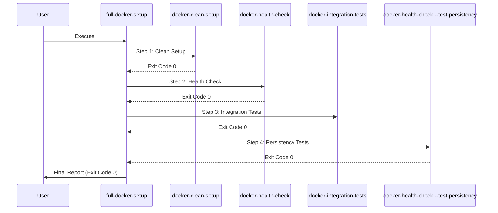

# Docker Setup für KRAI Engine

## 🐳 Überblick

Dieses Handbuch beschreibt das vollständige Docker-Setup für die KRAI Engine. Es basiert auf der konsolidierten `.env`-Struktur mit 10 Sektionen und mehr als 15 automatisch generierten Secrets. Für einen schnellen Einstieg nutze die Setup-Skripte und validiere anschließend die Umgebung, bevor du Docker-Services startest.

Weitere Einstiegsinformationen findest du im [README.md](README.md). Dieses Dokument konzentriert sich ausschließlich auf Docker.

---

## 🚀 Schnellstart

### Methode 1 – Automatisches Setup (empfohlen)

**Linux/macOS**

```bash
./setup.sh
```

**Windows (Empfohlen: PowerShell)**

```powershell
./setup.ps1
```

**Windows (Legacy: Batch)**

```cmd
setup.bat
```

**Welches Skript soll ich verwenden?**

- **Linux/macOS:** `./setup.sh` (Bash)
- **Windows 10/11:** `./setup.ps1` (PowerShell) – **Empfohlen**
- **Ältere Windows-Versionen:** `setup.bat` (Batch) – Nur als Fallback

**Warum setup.ps1 statt setup.bat?**
- ✅ Kürzer und wartbarer (299 vs. 744 Zeilen)
- ✅ Nutzt moderne .NET Crypto APIs
- ✅ Bessere Fehlerbehandlung (Try-Catch)
- ✅ Klarere Syntax (PowerShell vs. Batch)
- ✅ Gleiche Funktionalität wie setup.sh

Beide Skripte generieren:

- 15+ kryptographisch sichere Passwörter
- Ein RSA-2048 Keypair für JWT-Authentifizierung
- Eine vollständige `.env` Datei mit allen 10 Sektionen
- Eine Validierung über `scripts/validate_env.py`

### Methode 2 – Manuelle Einrichtung (nur wenn zwingend nötig)

```bash
cp .env.example .env
# ⚠️ 15+ Secrets müssen händisch nachgetragen werden – nur verwenden, wenn Setup-Skript nicht möglich ist!
```

### Validierung durchführen

```bash
python scripts/validate_env.py          # Pflichtvariablen prüfen
python scripts/validate_env.py --strict # Warnungen als Fehler behandeln
python scripts/validate_env.py --no-complexity   # Nur Mindestlänge erzwingen
python scripts/validate_env.py --docker-context off  # Docker-spezifische Checks überspringen
```

> ℹ️  Der Validator sucht automatisch nach `.env`, `.env.local` und `.env.database` (in dieser Reihenfolge). Bei Bedarf kannst du mit `--env-file path/to/custom.env` eine konkrete Datei prüfen.

### Docker starten

- Entwicklung (minimal):

  ```bash
  docker-compose -f docker-compose.simple.yml up -d
  ```

- Mit Firecrawl:

  ```bash
  docker-compose -f docker-compose.with-firecrawl.yml up -d
  ```

- Production-Parität:

  ```bash
  docker-compose -f docker-compose.production.yml up -d
  ```

---

## 🔄 Clean Setup Scripts

### Overview

The clean setup scripts provide automated Docker environment reset for development and testing scenarios. Use these scripts when you need to start completely fresh or resolve persistent issues.

### docker-clean-setup.sh (Linux/macOS)

**Location**: `scripts/docker-clean-setup.sh` 

**Usage:**
```bash
./scripts/docker-clean-setup.sh
```

**What it does:**

| Step | Action | Details |
|------|--------|---------|
| 1/7 | Prerequisites Check | Verifies Docker, Docker Compose, and `.env` file |
| 2/7 | Stop Containers | Executes `docker-compose down` |
| 3/7 | Remove Volumes | Deletes `krai_postgres_data`, `krai_minio_data`, `krai_ollama_data`, `krai_redis_data`, `laravel_vendor`, `laravel_node_modules` |
| 4/7 | Prune Networks | Removes unused Docker networks |
| 5/7 | Start Containers | Executes `docker-compose up -d` |
| 6/7 | Wait for Services | 60-second initialization period with countdown |
| 7/7 | Verify Seed Data | Confirms 14 manufacturers and 4 retry policies loaded |

**Expected Output:**

```
╔════════════════════════════════════════════╗
║  KRAI Docker Clean Setup Script           ║
╚════════════════════════════════════════════╝

[INFO] Step 1/7: Checking prerequisites...
[SUCCESS] ✓ Docker is available
[SUCCESS] ✓ Docker Compose is available (docker-compose)
[SUCCESS] ✓ .env file found

[INFO] Step 2/7: Stopping all Docker containers...
[SUCCESS] ✓ Containers stopped successfully

[INFO] Step 3/7: Removing KRAI volumes...
[SUCCESS] ✓ Removed volume: krai_postgres_data
[SUCCESS] ✓ Removed volume: krai_minio_data
[INFO] Volume not found: krai_redis_data (skipping)

[INFO] Step 4/7: Pruning Docker networks...
[SUCCESS] ✓ Networks pruned successfully

[INFO] Step 5/7: Starting fresh Docker containers...
[SUCCESS] ✓ Containers started successfully

[INFO] Step 6/7: Waiting 60 seconds for services to initialize...
[INFO] Time remaining: 60 seconds
...
[SUCCESS] ✓ Service initialization wait completed

[INFO] Step 7/7: Verifying seed data...
[INFO] Using PostgreSQL container: krai-postgres
[SUCCESS] ✓ Manufacturers count verified: 14
[SUCCESS] ✓ Retry policies count verified: 4

═══════════════════════════════════════════
[SUCCESS] ✓ Docker clean setup completed successfully!
═══════════════════════════════════════════
```

**Exit Codes:**
- `0` - Success: All steps completed, seed data verified
- `1` - Failure: One or more steps failed (check error messages)

**Idempotency:**
The script is idempotent - safe to run multiple times. Missing volumes are skipped with informational messages rather than errors.

### docker-clean-setup.ps1 (Windows)

**Location**: `scripts/docker-clean-setup.ps1` 

**Usage:**
```powershell
.\scripts\docker-clean-setup.ps1
```

**Features:**
- Identical functionality to Bash version
- PowerShell progress bars for wait periods
- Colored console output (Green=success, Yellow=warning, Red=error, Blue=info)
- Automatic Docker Compose command detection (`docker-compose` vs `docker compose`)

**Expected Output:**
Similar to Bash version with PowerShell-style formatting and progress indicators.

### When to Use Clean Setup

✅ **Use when:**
- Starting a new development cycle
- Resolving persistent database schema issues
- Testing fresh installation procedures
- Clearing corrupted volume data
- Benchmarking clean environment performance

❌ **Avoid when:**
- You have important data in the database
- Testing data persistence features
- Production or staging environments
- Debugging specific data-related issues

### Troubleshooting Clean Setup

**Issue: "Failed to remove volume (may be in use)"**
- **Cause**: Container still running or volume mounted elsewhere
- **Solution**: 
  ```bash
  docker-compose down -v  # Force remove volumes
  docker volume prune -f  # Remove all unused volumes
  ```

**Issue: "Seed data verification failed"**
- **Cause**: Database initialization scripts not executed
- **Solution**:
  ```bash
  docker logs krai-postgres  # Check initialization logs
  docker exec krai-postgres psql -U krai_user -d krai -f /docker-entrypoint-initdb.d/030_seeds.sql
  ```

**Issue: "PostgreSQL container not found"**
- **Cause**: Container name mismatch or not started
- **Solution**:
  ```bash
  docker ps -a | grep postgres  # Find actual container name
  # Update script or docker-compose.yml to match naming
  ```

---

## 🏥 Health Check Scripts

### Overview

The health check scripts validate all KRAI service components with detailed reporting. They support both regular health checks and data persistency testing.

### docker-health-check.sh (Linux/macOS)

**Location**: `scripts/docker-health-check.sh` 

**Usage:**

```bash
# Regular health checks
./scripts/docker-health-check.sh

# Data persistency tests
./scripts/docker-health-check.sh --test-persistency

# Help
./scripts/docker-health-check.sh --help
```

**Regular Health Checks:**

| Service | Checks Performed | Expected Values |
|---------|------------------|-----------------|
| **PostgreSQL** | Connection test, schema count, table count, manufacturers, retry policies, pgvector extension | 6 schemas, 44 tables, ≥14 manufacturers, ≥4 retry policies |
| **FastAPI Backend** | `/health` endpoint, database connectivity, `/docs` accessibility, `/redoc` accessibility | All endpoints return 200 OK |
| **Laravel Admin** | Dashboard accessibility, login page, database connection, Filament resources | ≥3 resources accessible |
| **MinIO** | API health, console accessibility, bucket operations (create/upload/download/delete) | All operations successful |
| **Ollama** | API availability, model presence, embedding generation | `nomic-embed-text` model, 768-dim embeddings |

**Expected Output (Success):**

```
==================================
KRAI Docker Health Check
==================================

ℹ️  Checking required commands...

ℹ️  Checking PostgreSQL...
✅ PostgreSQL connection successful
✅ Schema count: 6 (expected: 6)
✅ Table count: 44 (expected: 44)
✅ Manufacturers: 14 (expected: >=14)
✅ Retry policies: 4 (expected: >=4)
✅ pgvector extension: v0.5.1

ℹ️  Checking FastAPI Backend...
✅ Backend /health endpoint responding
  Database: healthy
  Storage: healthy
  AI: healthy
✅ Backend /docs (Swagger UI) accessible
✅ Backend /redoc (ReDoc) accessible

ℹ️  Checking Laravel Admin Dashboard...
✅ Laravel dashboard accessible
✅ Laravel login page accessible
✅ Laravel database connection successful
ℹ️  Checking Filament resources...
✅ Filament resources accessible (4/6)

ℹ️  Checking MinIO...
✅ MinIO API responding
✅ MinIO console accessible
✅ MinIO bucket creation successful
✅ MinIO file upload successful
✅ MinIO file download successful

ℹ️  Checking Ollama...
✅ Ollama API responding
✅ Model 'nomic-embed-text' found
✅ Embedding generation successful (dim: 768)

==================================
Health Check Summary
==================================
✅ All checks passed successfully!

Exit code: 0
```

**Expected Output (Warnings):**

```
⚠️  Manufacturers: 10 (expected: >=14)
  Recommendation: Load seed data: docker exec krai-postgres psql -U krai_user -d krai -f /docker-entrypoint-initdb.d/030_seeds.sql

==================================
Health Check Summary
==================================
⚠️  Some warnings detected. System is functional but may have degraded performance.

Exit code: 1
```

**Expected Output (Errors):**

```
❌ PostgreSQL connection failed
  Recommendation: Check PostgreSQL logs: docker logs krai-postgres

❌ Schema count: 3 (expected: 6)
  Recommendation: Run database migrations: docker exec krai-postgres psql -U krai_user -d krai -f /docker-entrypoint-initdb.d/001_core_schema.sql

==================================
Health Check Summary
==================================
❌ Critical errors detected. System may not function properly.

Exit code: 2
```

**Persistency Testing:**

```bash
./scripts/docker-health-check.sh --test-persistency
```

**What it does:**
1. Creates test manufacturer entry in PostgreSQL
2. Stops all containers with `docker-compose down` 
3. Restarts containers with `docker-compose up -d` 
4. Waits 60 seconds for initialization
5. Verifies test data persisted
6. Validates volume mounts (postgres_data, minio_data, ollama_data)
7. Cleans up test data

**Expected Output (Persistency Test):**

```
==================================
KRAI Data Persistency Tests
==================================

ℹ️  Testing Data Persistency Across Container Restarts

ℹ️  Creating test data...
✅ Test manufacturer created: TEST_PERSISTENCY_1706123456 (ID: 42)

ℹ️  Stopping containers...
✅ Containers stopped

ℹ️  Starting containers...
✅ Containers started

ℹ️  Waiting for services to initialize (60 seconds)...
  ✅ Wait complete

ℹ️  Verifying data persistence...
✅ Data persisted successfully!
  Verified: TEST_PERSISTENCY_1706123456 | http://test.persistency.local

ℹ️  Cleaning up test data...
✅ Test data cleaned up

ℹ️  Volume Mount Verification

✅ PostgreSQL volume 'krai_postgres_data' exists
✅ PostgreSQL volume correctly mounted
✅ MinIO volume 'minio_data' exists
✅ MinIO volume correctly mounted
✅ Ollama volume 'ollama_data' exists
✅ Ollama volume correctly mounted
✅ Redis volume 'redis_data' exists

==================================
Persistency Test Summary
==================================
✅ All persistency tests passed! Data survives container restarts.

Exit code: 0
```

### docker-health-check.ps1 (Windows)

**Location**: `scripts/docker-health-check.ps1` 

**Usage:**

```powershell
# Regular health checks
.\scripts\docker-health-check.ps1

# Data persistency tests
.\scripts\docker-health-check.ps1 -TestPersistency
```

**Features:**
- Identical functionality to Bash version
- PowerShell-native HTTP requests (`Invoke-RestMethod`, `Invoke-WebRequest`)
- Colored console output with emoji support
- Progress bars for wait periods

### Exit Codes

| Code | Meaning | Description |
|------|---------|-------------|
| `0` | Success | All checks passed without warnings or errors |
| `1` | Warnings | System functional but some non-critical issues detected (e.g., low manufacturer count, missing optional features) |
| `2` | Errors | Critical failures detected (e.g., service unreachable, database connection failed, required models missing) |

### Dependencies

**Required:**
- `docker` - Docker CLI
- `curl` - HTTP requests (Linux/macOS only)

**Optional:**
- `jq` - JSON parsing for detailed health check output (Linux/macOS)
- `mc` - MinIO client for bucket operation tests

**Install optional dependencies:**

```bash
# Linux (Debian/Ubuntu)
sudo apt-get install jq
wget https://dl.min.io/client/mc/release/linux-amd64/mc
chmod +x mc
sudo mv mc /usr/local/bin/

# macOS
brew install jq minio-mc

# Windows (PowerShell)
# jq not required (PowerShell has native JSON support)
# mc installation: https://min.io/docs/minio/windows/reference/minio-mc.html
```

### Troubleshooting Health Checks

**Issue: "curl: command not found" (Linux/macOS)**
- **Solution**: Install curl: `sudo apt-get install curl` (Debian/Ubuntu) or `brew install curl` (macOS)

**Issue: "jq: command not found" (Linux/macOS)**
- **Impact**: Health check still works but with less detailed output
- **Solution**: Install jq (optional): `sudo apt-get install jq` or `brew install jq` 

**Issue: "MinIO bucket operations not tested"**
- **Cause**: MinIO client (`mc`) not installed or credentials incorrect
- **Solution**: 
  ```bash
  # Install mc
  wget https://dl.min.io/client/mc/release/linux-amd64/mc
  chmod +x mc
  sudo mv mc /usr/local/bin/
  
  # Configure credentials
  mc alias set local http://localhost:9000 minioadmin <your-secret-key>
  ```

**Issue: "PostgreSQL container not found"**
- **Cause**: Container name mismatch (script checks `krai-postgres-prod` and `krai-postgres`)
- **Solution**: Verify container name: `docker ps | grep postgres` 

**Issue: "Embedding generation failed"**
- **Cause**: Ollama model not loaded or insufficient memory
- **Solution**:
  ```bash
  # Check model status
  docker exec krai-ollama ollama list
  
  # Pull model if missing
  docker exec krai-ollama ollama pull nomic-embed-text
  
  # Check Ollama logs
  docker logs krai-ollama --tail 50
  ```

**Issue: "Persistency test failed - data was lost"**
- **Cause**: Volume not mounted or incorrect volume configuration
- **Solution**:
  ```bash
  # Check volume configuration
  docker volume ls | grep krai
  docker inspect krai-postgres | grep -A 10 Mounts
  
  # Verify docker-compose.yml volume configuration
  grep -A 5 "volumes:" docker-compose.yml
  ```

---

## 🔗 Integration Tests

### Overview

Integration tests validate service-to-service connectivity and data flow across the KRAI stack. These tests ensure that components can communicate correctly and handle data operations end-to-end.

### docker-integration-tests.ps1 (Windows)

**Location**: `scripts/docker-integration-tests.ps1` 

**Usage:**

```powershell
# Run all integration tests
.\scripts\docker-integration-tests.ps1

# Run with authentication (recommended)
$env:BACKEND_API_TOKEN = "your-jwt-token-here"
.\scripts\docker-integration-tests.ps1
```

**Test Categories:**

#### 1. Backend → PostgreSQL Integration

**Tests:**
- ✅ Database connection via `/health` endpoint
- ✅ Read test: Query manufacturers table (expects ≥14 records)
- ✅ Write test: Create test document via API
- ✅ Transaction rollback test: Verify invalid documents rejected without stray rows

**Expected Output:**
```
ℹ️  Testing Backend → PostgreSQL integration...
✅ Backend database connection verified
✅ Manufacturers query successful: 14 records
✅ Test document created and persisted: test_integration_20260126143022
✅ Transaction rollback test passed (invalid document rejected)
✅ No stray rows inserted after rollback
```

#### 2. Backend → MinIO Integration

**Tests:**
- ✅ Upload test: Create and upload test image via `/api/v1/images/upload` 
- ✅ Download test: Verify file accessible via public URL
- ✅ Delete test: Remove file from storage via API

**Expected Output:**
```
ℹ️  Testing Backend → MinIO integration...
✅ File upload successful: image_id=abc123, storage_path=images/2026/01/test.png
✅ File download verified via public URL
✅ File deletion successful (image_id=abc123)
```

**Note**: Requires `BACKEND_API_TOKEN` environment variable for authentication.

#### 3. Backend → Ollama Integration

**Tests:**
- ✅ AI service health check via `/health` endpoint
- ✅ Embedding generation test: Generate 768-dim embedding for "integration test"
- ✅ Model availability check: Verify `nomic-embed-text` model present

**Expected Output:**
```
ℹ️  Testing Backend → Ollama integration...
✅ Backend AI service connection verified
✅ Embedding generation successful: 768 dimensions
✅ Model 'nomic-embed-text' available
```

#### 4. Laravel → Backend Integration

**Tests:**
- ✅ JWT token generation via Laravel Tinker
- ✅ Valid JWT authentication test: Call `/api/v1/pipeline/errors` with valid token
- ✅ Invalid JWT rejection test: Verify 401 response for invalid token
- ✅ REST API call test: Fetch pipeline errors from Laravel container

**Expected Output:**
```
ℹ️  Testing Laravel → Backend integration...
ℹ️  Attempting to retrieve JWT token from Laravel...
✅ JWT token retrieved from Laravel
✅ JWT authentication test passed (valid token accepted)
✅ JWT authentication test passed (invalid token rejected with 401)
✅ Laravel → Backend REST API call successful (with JWT)
```

**Note**: JWT service must be configured in Laravel. If unavailable, tests fall back to unauthenticated calls.

#### 5. Laravel → PostgreSQL Integration

**Tests:**
- ✅ Eloquent query test: Count manufacturers via `App\Models\Manufacturer::count()` 
- ✅ Product model test: Verify `App\Models\Product` accessible
- ✅ User model test: Count users (expects ≥1)
- ✅ PipelineError model test: Verify `App\Models\PipelineError` accessible

**Expected Output:**
```
ℹ️  Testing Laravel → PostgreSQL integration...
✅ Laravel Eloquent query successful: 14 manufacturers
✅ Product model test passed
✅ User model test passed: 1 users
✅ PipelineError model test passed
```

### Integration Test Report

**Expected Output (All Tests Passed):**

```
╔═══════════════════════════════════════════════════════════╗
║  KRAI Docker Integration Tests                            ║
╚═══════════════════════════════════════════════════════════╝

ℹ️  Testing Backend → PostgreSQL integration...
✅ Backend database connection verified
✅ Manufacturers query successful: 14 records
✅ Test document created and persisted: test_integration_20260126143022
✅ Transaction rollback test passed (invalid document rejected)
✅ No stray rows inserted after rollback

ℹ️  Testing Backend → MinIO integration...
✅ File upload successful: image_id=abc123, storage_path=images/2026/01/test.png
✅ File download verified via public URL
✅ File deletion successful (image_id=abc123)

ℹ️  Testing Backend → Ollama integration...
✅ Backend AI service connection verified
✅ Embedding generation successful: 768 dimensions
✅ Model 'nomic-embed-text' available

ℹ️  Testing Laravel → Backend integration...
✅ JWT token retrieved from Laravel
✅ JWT authentication test passed (valid token accepted)
✅ JWT authentication test passed (invalid token rejected with 401)
✅ Laravel → Backend REST API call successful (with JWT)

ℹ️  Testing Laravel → PostgreSQL integration...
✅ Laravel Eloquent query successful: 14 manufacturers
✅ Product model test passed
✅ User model test passed: 1 users
✅ PipelineError model test passed

ℹ️  Cleaning up test data...
ℹ️  Removed test document: test_integration_20260126143022
ℹ️  Removed test image: abc123

╔═══════════════════════════════════════════════════════════╗
║  Integration Test Results                                 ║
╠═══════════════════════════════════════════════════════════╣
║  Total:                       ✅ 18/18 passed             ║
╚═══════════════════════════════════════════════════════════╝

✅ All integration tests passed successfully!

Exit code: 0
```

**Expected Output (With Warnings):**

```
╔═══════════════════════════════════════════════════════════╗
║  Integration Test Results                                 ║
╠═══════════════════════════════════════════════════════════╣
║  Total:                       ✅ 15/18 passed             ║
║  Failed:                      3 tests                        ║
╚═══════════════════════════════════════════════════════════╝

⚠️  Some tests passed with warnings

Exit code: 1
```

### Exit Codes

| Code | Meaning | Description |
|------|---------|-------------|
| `0` | Success | All integration tests passed |
| `1` | Warnings | Some tests passed with warnings (e.g., authentication unavailable, optional features missing) |
| `2` | Errors | Critical integration failures (e.g., service unreachable, data operations failed) |

### Environment Variables

| Variable | Required | Description | Example |
|----------|----------|-------------|---------|
| `BACKEND_API_TOKEN` | Optional | JWT token for authenticated API calls | `eyJhbGciOiJSUzI1NiIsInR5cCI6IkpXVCJ9...` |

**Generate Backend API Token:**

```powershell
# Option 1: Via Laravel Tinker
docker exec krai-laravel-admin php artisan tinker --execute="echo (new \App\Services\JwtService())->generateToken(['user_id' => 1, 'role' => 'admin']);"

# Option 2: Via Backend API (if authentication endpoint exists)
$response = Invoke-RestMethod -Uri "http://localhost:8000/api/v1/auth/login" -Method Post -Body (@{username="admin"; password="your-password"} | ConvertTo-Json) -ContentType "application/json"
$env:BACKEND_API_TOKEN = $response.access_token
```

### Troubleshooting Integration Tests

**Issue: "Backend token not set - skipping write tests"**
- **Impact**: Write, upload, and delete tests skipped
- **Solution**: Set `BACKEND_API_TOKEN` environment variable (see above)

**Issue: "JWT service not available"**
- **Cause**: Laravel JWT service not configured or Tinker command failed
- **Solution**:
  ```powershell
  # Verify JWT service exists
  docker exec krai-laravel-admin php artisan tinker --execute="class_exists('App\Services\JwtService');"
  
  # Check Laravel logs
  docker logs krai-laravel-admin --tail 50
  ```

**Issue: "Document creation failed (check authentication)"**
- **Cause**: Invalid or expired JWT token
- **Solution**: Regenerate token and verify it's valid:
  ```powershell
  # Test token manually
  $headers = @{ "Authorization" = "Bearer $env:BACKEND_API_TOKEN" }
  Invoke-RestMethod -Uri "http://localhost:8000/api/v1/pipeline/errors?page=1&page_size=1" -Headers $headers
  ```

**Issue: "File upload failed"**
- **Cause**: MinIO not accessible, credentials incorrect, or bucket missing
- **Solution**:
  ```powershell
  # Check MinIO health
  Invoke-WebRequest -Uri "http://localhost:9000/minio/health/live"
  
  # Verify buckets exist
  docker exec krai-minio mc ls local/
  
  # Initialize MinIO if needed
  python scripts/init_minio.py
  ```

**Issue: "Embedding generation failed"**
- **Cause**: Ollama model not loaded or service unavailable
- **Solution**:
  ```powershell
  # Check Ollama status
  Invoke-RestMethod -Uri "http://localhost:11434/api/tags"
  
  # Pull model if missing
  docker exec krai-ollama ollama pull nomic-embed-text
  ```

**Issue: "Laravel Eloquent query failed"**
- **Cause**: Database connection issue or model not found
- **Solution**:
  ```powershell
  # Test database connection
  docker exec krai-laravel-admin php artisan db:show
  
  # Verify models exist
  docker exec krai-laravel-admin php artisan tinker --execute="class_exists('App\Models\Manufacturer');"
  ```

### Linux/macOS Integration Tests

**Note**: The Bash version (`docker-integration-tests.sh`) is currently minimal. Use the PowerShell version on Windows or adapt the PowerShell logic to Bash for Linux/macOS environments.

**Workaround for Linux/macOS:**
```bash
# Run PowerShell script via PowerShell Core (if installed)
pwsh ./scripts/docker-integration-tests.ps1

# Or manually test integrations using curl
curl -X GET http://localhost:8000/health
curl -X GET http://localhost:8000/api/v1/pipeline/errors?page=1&page_size=10
```

---

## 🚀 Full Docker Setup Orchestrator

### Overview

The `full-docker-setup` script orchestrates the complete Docker setup workflow by running all validation scripts in sequence. This provides a comprehensive end-to-end validation of your KRAI environment.

### Execution Sequence



### Usage

**Linux/macOS:**
```bash
# Full setup with all steps
./scripts/full-docker-setup.sh

# Skip clean setup (faster validation)
./scripts/full-docker-setup.sh --skip-clean

# Skip integration tests
./scripts/full-docker-setup.sh --skip-integration

# Save logs to file
./scripts/full-docker-setup.sh --log-file setup.log

# Show help
./scripts/full-docker-setup.sh --help
```

**Windows (PowerShell):**
```powershell
# Full setup with all steps
.\scripts\full-docker-setup.ps1

# Skip clean setup
.\scripts\full-docker-setup.ps1 -SkipClean

# Skip integration tests
.\scripts\full-docker-setup.ps1 -SkipIntegration

# Save logs to file
.\scripts\full-docker-setup.ps1 -LogFile "setup.log"

# Show help
Get-Help .\scripts\full-docker-setup.ps1 -Detailed
```

### Expected Output

**Successful Execution:**
```
╔═══════════════════════════════════════════════════════════╗
║  KRAI Full Docker Setup - Starting Workflow              ║
╚═══════════════════════════════════════════════════════════╝

[2026-01-26 14:30:00] ━━━━━━━━━━━━━━━━━━━━━━━━━━━━━━━━━━━━━
[INFO] Step 1/4: Running Clean Setup...
[2026-01-26 14:30:00] ━━━━━━━━━━━━━━━━━━━━━━━━━━━━━━━━━━━━━

╔════════════════════════════════════════════╗
║  KRAI Docker Clean Setup Script           ║
╚════════════════════════════════════════════╝

[INFO] Step 1/7: Checking prerequisites...
[SUCCESS] ✓ Docker is available
[SUCCESS] ✓ Docker Compose is available (docker compose)
[SUCCESS] ✓ .env file found
...
[SUCCESS] ✓ Docker clean setup completed successfully!

[2026-01-26 14:32:15] ━━━━━━━━━━━━━━━━━━━━━━━━━━━━━━━━━━━━━
[SUCCESS] ✅ Step 1 completed (Duration: 2m 15s, Exit Code: 0)
[2026-01-26 14:32:15] ━━━━━━━━━━━━━━━━━━━━━━━━━━━━━━━━━━━━━

[2026-01-26 14:32:15] ━━━━━━━━━━━━━━━━━━━━━━━━━━━━━━━━━━━━━
[INFO] Step 2/4: Running Health Check...
[2026-01-26 14:32:15] ━━━━━━━━━━━━━━━━━━━━━━━━━━━━━━━━━━━━━

==================================
KRAI Docker Health Check
==================================
...
[SUCCESS] ✅ All checks passed successfully!

[2026-01-26 14:33:00] ━━━━━━━━━━━━━━━━━━━━━━━━━━━━━━━━━━━━━
[SUCCESS] ✅ Step 2 completed (Duration: 45s, Exit Code: 0)
[2026-01-26 14:33:00] ━━━━━━━━━━━━━━━━━━━━━━━━━━━━━━━━━━━━━

... (Steps 3 and 4 follow similar pattern)

╔═══════════════════════════════════════════════════════════╗
║  KRAI Full Docker Setup - Final Report                   ║
╠═══════════════════════════════════════════════════════════╣
║  Step 1: Clean Setup                                      ║
║    Status: ✅ SUCCESS (Exit Code: 0)                      ║
║    Duration: 2m 15s                                       ║
║    Timestamp: 2026-01-26 14:30:00                         ║
║                                                           ║
║  Step 2: Health Check                                     ║
║    Status: ✅ SUCCESS (Exit Code: 0)                      ║
║    Duration: 45s                                          ║
║    Timestamp: 2026-01-26 14:32:15                         ║
║                                                           ║
║  Step 3: Integration Tests                                ║
║    Status: ✅ SUCCESS (Exit Code: 0)                      ║
║    Duration: 1m 30s                                       ║
║    Timestamp: 2026-01-26 14:33:00                         ║
║                                                           ║
║  Step 4: Persistency Tests                                ║
║    Status: ✅ SUCCESS (Exit Code: 0)                      ║
║    Duration: 3m 10s                                       ║
║    Timestamp: 2026-01-26 14:34:30                         ║
╠═══════════════════════════════════════════════════════════╣
║  Overall Status: ✅ ALL STEPS COMPLETED SUCCESSFULLY      ║
║  Total Duration: 7m 40s                                   ║
║  Final Exit Code: 0                                       ║
╚═══════════════════════════════════════════════════════════╝

[SUCCESS] ✅ KRAI Docker environment is fully validated and ready!
```

**Execution with Warnings:**
```
╔═══════════════════════════════════════════════════════════╗
║  KRAI Full Docker Setup - Final Report                   ║
╠═══════════════════════════════════════════════════════════╣
║  Step 1: Clean Setup                                      ║
║    Status: ✅ SUCCESS (Exit Code: 0)                      ║
║    Duration: 2m 15s                                       ║
║                                                           ║
║  Step 2: Health Check                                     ║
║    Status: ⚠️  WARNING (Exit Code: 1)                     ║
║    Duration: 45s                                          ║
║    Issues: MinIO bucket operations not tested             ║
║                                                           ║
║  Step 3: Integration Tests                                ║
║    Status: ⚠️  WARNING (Exit Code: 1)                     ║
║    Duration: 1m 30s                                       ║
║    Issues: Backend token not set, write tests skipped     ║
║                                                           ║
║  Step 4: Persistency Tests                                ║
║    Status: ✅ SUCCESS (Exit Code: 0)                      ║
║    Duration: 3m 10s                                       ║
╠═══════════════════════════════════════════════════════════╣
║  Overall Status: ⚠️  COMPLETED WITH WARNINGS              ║
║  Total Duration: 7m 40s                                   ║
║  Final Exit Code: 1                                       ║
╚═══════════════════════════════════════════════════════════╝

[WARNING] ⚠️  System is functional but some warnings were detected.
Recommendations:
  - Set BACKEND_API_TOKEN environment variable for full integration tests
  - Install MinIO client (mc) for bucket operation tests
  - Review individual step logs for detailed warnings
```

### Exit Codes

| Exit Code | Status | Description | Action Required |
|-----------|--------|-------------|-----------------|
| `0` | ✅ Success | All steps completed without errors | None - system ready |
| `1` | ⚠️ Warning | Some warnings detected, system functional | Review warnings, optional fixes |
| `2` | ❌ Error | Critical errors detected | Manual intervention required |

### Troubleshooting

#### Step 1 (Clean Setup) Fails

**Symptom:** Clean setup exits with code 1 or 2

**Common Causes:**
- Docker daemon not running
- Insufficient permissions
- Volumes in use by other processes
- Missing .env file

**Solutions:**
```bash
# Check Docker status
docker ps

# Check Docker Compose
docker compose version

# Verify .env file exists
ls -la .env

# Run clean setup individually for detailed output
./scripts/docker-clean-setup.sh
```

#### Step 2 (Health Check) Fails

**Symptom:** Health check exits with code 2

**Common Causes:**
- Services not fully started (wait longer)
- Port conflicts
- Database schema/seed data issues

**Solutions:**
```bash
# Wait additional time for services
sleep 30

# Check service logs
docker logs krai-postgres
docker logs krai-engine
docker logs krai-laravel-admin

# Run health check individually
./scripts/docker-health-check.sh
```

#### Step 3 (Integration Tests) Fails

**Symptom:** Integration tests exit with code 1 or 2

**Common Causes:**
- Missing BACKEND_API_TOKEN
- Service connectivity issues
- Authentication failures

**Solutions:**
```bash
# Set backend token (if available)
export BACKEND_API_TOKEN="your-token-here"

# Test service connectivity manually
curl http://localhost:8000/health
curl http://localhost:8080/kradmin

# Run integration tests individually
./scripts/docker-integration-tests.sh
```

#### Step 4 (Persistency Tests) Fails

**Symptom:** Persistency tests exit with code 2

**Common Causes:**
- Volume mount issues
- Data not persisting across restarts
- Container restart failures

**Solutions:**
```bash
# Check volume mounts
docker volume ls
docker inspect krai-postgres

# Verify docker-compose.yml volume configuration
grep -A 5 "volumes:" docker-compose.yml

# Run persistency tests individually
./scripts/docker-health-check.sh --test-persistency
```

### Best Practices

1. **Initial Setup:** Always run full setup on first installation
2. **After Changes:** Run after modifying docker-compose.yml or .env
3. **CI/CD Integration:** Use in deployment pipelines for validation
4. **Troubleshooting:** Run individual steps for detailed diagnostics
5. **Performance:** Use `--skip-clean` for faster validation when environment is already clean

### CI/CD Integration

**GitHub Actions Example:**
```yaml
name: Docker Setup Validation
on: [push, pull_request]

jobs:
  validate:
    runs-on: ubuntu-latest
    steps:
      - uses: actions/checkout@v3
      - name: Run Full Docker Setup
        run: |
          ./setup.sh
          ./scripts/full-docker-setup.sh
        env:
          BACKEND_API_TOKEN: ${{ secrets.BACKEND_API_TOKEN }}
      - name: Upload Logs
        if: failure()
        uses: actions/upload-artifact@v3
        with:
          name: setup-logs
          path: setup.log
```

**GitLab CI Example:**
```yaml
docker-validation:
  stage: test
  script:
    - ./setup.sh
    - ./scripts/full-docker-setup.sh --log-file setup.log
  artifacts:
    when: on_failure
    paths:
      - setup.log
  only:
    - main
    - develop
```

### Related Scripts

- `scripts/docker-clean-setup.sh` - Clean environment reset
- `scripts/docker-health-check.sh` - Service health validation
- `scripts/docker-integration-tests.sh` - Integration testing
- `scripts/verify_local_setup.py` - Python-based verification (alternative)

### See Also

- [Clean Setup Scripts](#-clean-setup-scripts)
- [Health Check Scripts](#-health-check-scripts)
- [Integration Tests](#-integration-tests)
- [Exit Codes Reference](#-exit-codes-reference)

---

## 🐳 Docker Compose Files Übersicht

Das Projekt bietet 3 produktionsreife Docker Compose Konfigurationen:

### docker-compose.simple.yml
**Anwendungsfall**: Minimale Entwicklungsumgebung
**Services**: Frontend, Backend, PostgreSQL, MinIO, Ollama (5 Services)
**Best für**: Schnelles Testen, Entwicklung, ressourcenbeschränkte Umgebungen
**Features**: Kein Firecrawl, keine GPU erforderlich, saubere Minimal-Stack

### docker-compose.with-firecrawl.yml
**Anwendungsfall**: Entwicklung mit erweitertem Web Scraping
**Services**: Alle simple.yml Services + Redis, Playwright, Firecrawl API (10 Services)
**Best für**: Testen von Web Scraping Features, Dokumentenverarbeitung mit Web-Quellen
**Features**: Firecrawl für bessere Web-Inhaltsextraktion

### docker-compose.production.yml
**Anwendungsfall**: Production Deployment
**Services**: Alle with-firecrawl.yml Services + Firecrawl Worker (11 Services)
**Best für**: Production Deployments, GPU-beschleunigte Inferenz
**Features**: GPU-Unterstützung für Ollama, optimierte PostgreSQL-Einstellungen, Production Healthchecks

> **Hinweis**: 7 veraltete Docker Compose Dateien wurden archiviert, um Verwirrung zu reduzieren. Siehe `archive/docker/README.md` für Details.

---

## 🧩 Struktur der `.env` Datei

Die konsolidierte `.env` enthält 10 Sektionen mit 60+ Variablen. Die folgenden Bereiche werden automatisch befüllt:

| Sektion | Umfang | Secrets |
| ------- | ------ | ------- |
| 1. Application Settings | 4 Variablen | – |
| 2. Database Configuration | 16 Variablen | `DATABASE_PASSWORD` |
| 3. Object Storage | 28 Variablen | `OBJECT_STORAGE_SECRET_KEY` |
| 4. AI Service | 58 Variablen | – |
| 5. Authentication & Security | 64 Variablen | `JWT_PRIVATE_KEY`, `JWT_PUBLIC_KEY`, `DEFAULT_ADMIN_PASSWORD` |
| 6. Processing Pipeline | 27 Variablen | – |
| 7. Web Scraping | 45 Variablen | `OPENAI_API_KEY` (optional) |
| 8. External API Keys | 19 Variablen | `YOUTUBE_API_KEY`, `CLOUDFLARE_TUNNEL_TOKEN` |
| 9. Docker Compose | 64 Variablen | n8n, pgAdmin, Firecrawl, Test-Credentials |
| 10. Security Reminders | Hinweise | – |

> **⚠️ WICHTIG - Migration abgeschlossen:** Supabase- und R2-Variablen sind in der `.env` auskommentiert und deprecated. **Die Migration zu PostgreSQL + MinIO wurde im November 2024 (KRAI-002) abgeschlossen.** Verwende ausschließlich PostgreSQL + MinIO für alle Deployments. Für Legacy-Nutzer, die von Supabase migrieren: Siehe `docs/SUPABASE_TO_POSTGRESQL_MIGRATION.md`.

### Kritische Variablen (müssen gesetzt sein)

- `DATABASE_PASSWORD`
- `OBJECT_STORAGE_SECRET_KEY`
- `JWT_PRIVATE_KEY` & `JWT_PUBLIC_KEY`
- `DEFAULT_ADMIN_PASSWORD`
- `OLLAMA_URL`

Diese Werte werden durch die Setup-Skripte erzeugt und sollten nicht manuell geändert werden.

> **⚠️ Removed (November 2024, KRAI-002):** `SUPABASE_*` und `R2_*` Variablen wurden entfernt und werden nicht mehr unterstützt. Verwende ausschließlich `DATABASE_*` (PostgreSQL) und `OBJECT_STORAGE_*` (MinIO) Variablen.

### Optionale Variablen (Warnungen bei fehlender Konfiguration)

- `YOUTUBE_API_KEY` → Google Cloud Console
- `CLOUDFLARE_TUNNEL_TOKEN` → Cloudflare Dashboard
- `OPENAI_API_KEY` → Nur erforderlich, wenn `FIRECRAWL_LLM_PROVIDER=openai`

### Docker-spezifische Standardwerte (nicht anpassen)

- `DATABASE_HOST=krai-postgres` (nicht `SUPABASE_URL`)
- `OBJECT_STORAGE_ENDPOINT=http://krai-minio:9000` (nicht `MINIO_ENDPOINT`)
- `OLLAMA_URL=http://krai-ollama:11434` (nicht `OLLAMA_BASE_URL`)

Für lokale Host-Verbindungen separate `.env.local` oder Overrides nutzen. Kopiere dazu
`.env.local.example` nach `.env.local` und setze dort `DATABASE_HOST`/
`POSTGRES_HOST`/`DATABASE_CONNECTION_URL` auf `localhost`, damit Host-Prozesse über
die veröffentlichten Ports mit den Docker-Containern sprechen.

> **Wichtig:** Diese Werte sind für Docker Compose optimiert. Für Host-Zugriff verwende `localhost` statt Service-Namen.

---

## 🌐 Zugängliche Dienste

| Service | URL | Benutzer | Credentials | Verfügbar in |
| ------- | --- | -------- | ----------- | ------------ |
| Frontend | http://localhost | – | – | Alle Compose-Dateien |
| Backend API | http://localhost:8000 | – | – | Alle Compose-Dateien |
| API Docs | http://localhost:8000/docs | – | – | Alle Compose-Dateien |
| Health Check | http://localhost:8000/health | – | – | Alle Compose-Dateien |
| MinIO Console | http://localhost:9001 | minioadmin | aus `.env` | Alle Compose-Dateien |
| Redis | localhost:6379 | – | – | with-firecrawl, production |
| Playwright | localhost:3000 | – | – | with-firecrawl, production |
| Firecrawl API | http://localhost:9002 | – | – | with-firecrawl, production |
| Ollama API | http://localhost:11434 | – | – | Alle Compose-Dateien |

> **Hinweis**: n8n und pgAdmin sind nur in archivierten Compose-Dateien verfügbar. Siehe `archive/docker/README.md`.

### Port 3000 Clarification

**Port 3000** is used by the Playwright service (internal to Firecrawl) for browser automation and web scraping. This is NOT a user-facing dashboard.

- **Playwright Service**: http://localhost:3000 (internal, used by Firecrawl)
- **User Dashboard**: http://localhost:80 (Laravel/Filament)

Do not confuse these two services.

---

## 🛠️ Setup-Skripte im Detail

### setup.ps1 (Windows 10/11 - Empfohlen)

- Generiert 15+ sichere Passwörter mit .NET `RNGCryptoServiceProvider`
- Generiert RSA 2048-bit Schlüsselpaar mit .NET Crypto API
- Fallback zu OpenSSL wenn .NET APIs nicht verfügbar
- Erstellt vollständige `.env` mit allen 10 Sektionen
- Zeigt generierte Credentials strukturiert an
- Validiert `.env` nach Erstellung
- Warnt bei fehlenden optionalen Variablen
- **Vorteile:** Modern, wartbar, sicher, kurz (299 Zeilen)
- **Anforderungen:** PowerShell 5.0+ (in Windows 10/11 enthalten)

**Ausführung:**

```powershell
# Standard-Ausführung
./setup.ps1

# Mit Force-Flag (überschreibt .env ohne Nachfrage)
./setup.ps1 -Force
```

**Troubleshooting:**
- **Execution Policy blockiert:** `Set-ExecutionPolicy -Scope CurrentUser RemoteSigned`
- **OpenSSL nicht gefunden:** Installiere OpenSSL oder nutze PowerShell 7+
- **Skript nicht gefunden:** Nutze `./setup.ps1` (mit Backslash in PowerShell: `.\setup.ps1`)

### setup.sh (Linux/macOS)

- Passwörter per `openssl rand -base64`
- RSA-2048 Keypair für JWT
- Vollständige `.env` mit allen Sektionen
- Automatische Validierung via `scripts/validate_env.py`
- Hinweise auf fehlende optionale Variablen

### setup.bat (Windows - Legacy Fallback)

- Gleiche Funktionalität wie setup.ps1
- Nutzt PowerShell-Aufrufe für Passwort-Generierung
- RSA-Keys via PowerShell Crypto API oder OpenSSL
- **Nachteile:** Komplex (744 Zeilen), schwer zu debuggen, Batch-Syntax fehleranfällig
- **Nur verwenden wenn:** PowerShell 5.0+ nicht verfügbar (sehr alte Windows-Versionen)

**Ausführung:**

```cmd
REM Standard-Ausführung
setup.bat

REM Mit Force-Flag
set FORCE=1
setup.bat
```

### Sicherheitshinweise

- Secrets werden nur lokal erzeugt
- `.env` steht in `.gitignore` (niemals committen)
- Kopiere `.env` nur auf vertrauenswürdige Systeme

---

## ✅ Validierung & Healthchecks

### Automatische Validierung

```bash
python scripts/validate_env.py          # Pflichtvariablen prüfen
python scripts/validate_env.py --verbose
python scripts/validate_env.py --strict
```

Der Validator prüft u. a.:

- Vollständigkeit aller kritischen Variablen
- Passwortlängen & optional aktivierte Komplexitätsregeln (`PASSWORD_REQUIRE_*`, `PASSWORD_MIN_LENGTH`)
- Base64-Format der JWT-Keys
- Docker-Service-Namen (`krai-postgres`, `krai-minio`, `krai-ollama`) – nur im Docker-Kontext aktiv
- Optionale Variablen mit Warnungen
- Firecrawl API Key Pflicht nur, wenn `FIRECRAWL_REQUIRE_API_KEY=true` oder `FIRECRAWL_API_URL` auf eine externe Domain zeigt

Exit-Codes: `0` (OK), `1` (Warnungen), `2` (Fehler oder Warnungen in `--strict`).

### Service-Validierung nach dem Start

```bash
python scripts/verify_local_setup.py
python scripts/verify_local_setup.py --service postgresql
```

Der Service-Checker nutzt Healthchecks aus `docker-compose.*`:

- PostgreSQL → `pg_isready -U "$POSTGRES_USER" -d "$POSTGRES_DB"`
- MinIO → `wget -qO- http://localhost:9000/minio/health/live`
- Ollama → `curl -f http://localhost:11434/api/tags`
- Redis → `redis-cli PING`
- Frontend → `wget --spider http://localhost/`
- Backend → `curl -f http://localhost:8000/health`

---

## 🆘 Troubleshooting

### Häufige Probleme & Lösungen

1. **`.env` fehlt oder ist unvollständig**
   - Symptom: Container starten nicht, Fehler wie `DATABASE_PASSWORD not set`
   - Lösung: `./setup.sh` bzw. `setup.bat` ausführen oder `.env.example` kopieren
   - Validierung: `python scripts/validate_env.py`

2. **Port-Konflikte (5432, 9000, 11434, 8000)**
   - Symptom: "port already in use"
   - Lösung: `netstat -tulpn | grep :5432` (Linux) oder `netstat -ano | findstr :5432` (Windows)
   - Alternative: Ports in `docker-compose.*` anpassen

3. **Falsche Credentials**
   - Symptom: "Authentication failed"
   - Lösung: Docker-Hostnamen beibehalten (`krai-postgres`, `krai-minio`, `krai-ollama`)
   - Für Host-Zugriff separate `.env.local` nutzen

4. **GPU wird nicht erkannt**
   - Symptom: Ollama läuft nur auf CPU
   - Lösung: NVIDIA Container Toolkit installieren, `docker run --rm --gpus all nvidia/cuda:11.0-base nvidia-smi`
   - Fallback: `USE_GPU=false`

5. **Out-of-Memory (OOM)**
   - Symptom: Container `OOMKilled`
   - Lösung: Kleinere Ollama-Modelle (`llama3.2:1b`), Docker Memory Limit erhöhen, Batch-Sizes reduzieren

6. **MinIO-Buckets fehlen**
   - Symptom: "Bucket not found"
   - Lösung: `python scripts/init_minio.py` oder manuell über http://localhost:9001

7. **Ollama-Modelle fehlen**
   - Symptom: "Model not found"
   - Lösung: `docker exec krai-ollama ollama pull nomic-embed-text:latest`
   - Überprüfen mit `docker exec krai-ollama ollama list`

8. **Vision-Model stürzt ab**
   - Symptom: CUDA Out-of-memory
   - Lösung: `DISABLE_VISION_PROCESSING=true`, `MAX_VISION_IMAGES=1`, kleineres Modell (`llava:7b`)

9. **Firecrawl startet nicht (Restart Loop)**
   - **Symptom:** Container `krai-firecrawl-api-prod` und `krai-playwright-prod` in Restart-Schleife
   - **Ursachen & Lösungen:**

     a) **Playwright Healthcheck schlägt fehl:**
        - Prüfen: `docker logs krai-playwright-prod --tail 20`
        - Lösung: Healthcheck muss `/pressure` Endpoint verwenden
        - Test: `curl http://localhost:3000/pressure` (sollte 200 zurückgeben)
        - Fix: `HEALTH=true` Environment Variable in Playwright Service setzen

     b) **Falsche Playwright URL:**
        - Prüfen: `docker exec krai-firecrawl-api-prod env | grep PLAYWRIGHT`
        - Problem: `PLAYWRIGHT_MICROSERVICE_URL` enthält `/scrape` Suffix
        - Lösung: URL muss `http://krai-playwright:3000` sein (ohne `/scrape`)

     c) **Firecrawl API Healthcheck fehlerhaft:**
        - Prüfen: `docker inspect krai-firecrawl-api-prod | grep -A 5 Healthcheck`
        - Problem: Endpoint `/api/v1/status` existiert nicht
        - Lösung: Healthcheck auf `/health` oder TCP-Check ändern

     d) **Ollama Modelle fehlen:**
        - Prüfen: `docker exec krai-ollama ollama list`
        - Lösung: Modelle pullen (siehe Punkt 7)

   - **Vollständige Diagnose:**

     ```bash
     # Container Status prüfen
     docker-compose -f docker-compose.with-firecrawl.yml ps

     # Logs aller Firecrawl Services
     docker-compose -f docker-compose.with-firecrawl.yml logs krai-playwright krai-firecrawl-api krai-firecrawl-worker

     # Playwright Health testen
     curl -v http://localhost:3000/pressure

     # Firecrawl API testen
     curl -v http://localhost:9002/health
     ```

   - **Reset-Prozedur:**

     ```bash
     # Services stoppen
     docker-compose -f docker-compose.with-firecrawl.yml down

     # .env Variablen prüfen
     grep -E "PLAYWRIGHT|FIRECRAWL" .env

     # Services neu starten
     docker-compose -f docker-compose.with-firecrawl.yml up -d krai-redis krai-playwright

     # Warten bis Playwright healthy ist
     docker-compose -f docker-compose.with-firecrawl.yml ps krai-playwright

     # Firecrawl Services starten
     docker-compose -f docker-compose.with-firecrawl.yml up -d krai-firecrawl-api krai-firecrawl-worker
     ```

10. **JWT-Authentifizierung schlägt fehl**
    - Symptom: "Invalid token"
    - Lösung: `JWT_PRIVATE_KEY` & `JWT_PUBLIC_KEY` prüfen, Base64-Format sicherstellen, bei Bedarf `./setup.sh`

11. **PowerShell-Skript wird nicht ausgeführt**
    - Symptom: "setup.ps1 cannot be loaded because running scripts is disabled"
    - Lösung: Execution Policy anpassen:
      ```powershell
      Set-ExecutionPolicy -Scope CurrentUser RemoteSigned
      ```
    - Alternative: Batch-Skript verwenden: `setup.bat`
    - Dokumentation: <https://docs.microsoft.com/en-us/powershell/module/microsoft.powershell.security/set-executionpolicy>

12. **setup.bat schlägt fehl mit "RSA key generation failed"**
    - Symptom: Fehler bei RSA-Key-Generierung in setup.bat
    - Lösung: Nutze setup.ps1 statt setup.bat:
      ```powershell
      ./setup.ps1
      ```
    - Oder: Installiere OpenSSL und füge zu PATH hinzu
    - Grund: setup.bat ist komplexer und fehleranfälliger als setup.ps1

13. **"setup.ps1 not found" auf Windows**
    - Symptom: PowerShell findet setup.ps1 nicht
    - Lösung: Nutze `./setup.ps1` (oder `.\setup.ps1`) statt `setup.ps1`
    - Grund: PowerShell erfordert expliziten Pfad für lokale Skripte

### Diagnosebefehle

- `docker-compose ps`
- `docker-compose logs -f [service]`
- `docker stats`
- `docker inspect [container]`
- `python scripts/validate_env.py --verbose`
- `python scripts/verify_local_setup.py --verbose`

### Reset-Prozeduren

- **Soft Reset:** `docker-compose restart`
- **Hard Reset:** `docker-compose down && docker-compose up -d`
- **Full Reset (löscht Daten!):** `docker-compose down -v && docker-compose up -d --build`

---

## 🔍 Firecrawl Spezifische Diagnose

### Service-Abhängigkeiten

Firecrawl Stack hat folgende Abhängigkeiten:
```
krai-redis (healthy)
  ↓
krai-playwright (healthy)
  ↓
krai-firecrawl-api (healthy)
  ↓
krai-firecrawl-worker (started)
```

### Healthcheck-Endpoints

| Service | Endpoint | Erwartete Antwort |
|---------|----------|-------------------|
| Playwright | `http://localhost:3000/pressure` | HTTP 200 + JSON |
| Firecrawl API | `http://localhost:9002/health` | HTTP 200 |
| Redis | `redis-cli PING` | PONG |

### Häufige Fehlermeldungen

1. **"Error: connect ECONNREFUSED 127.0.0.1:3000"**
   - Ursache: Playwright Service nicht erreichbar
   - Lösung: Playwright Healthcheck korrigieren

2. **"Playwright service unhealthy"**
   - Ursache: `/pressure` Endpoint nicht verfügbar
   - Lösung: `HEALTH=true` Environment Variable setzen

3. **"Worker failed to start"**
   - Ursache: Ollama Service nicht verfügbar oder Modelle fehlen
   - Lösung: Ollama Modelle pullen (siehe Punkt 7)

### Performance-Tuning

```bash
# Playwright Memory-Limit erhöhen
PLAYWRIGHT_MAX_CONCURRENT_SESSIONS=5  # Reduzieren bei wenig RAM

# Firecrawl Worker-Anzahl anpassen
FIRECRAWL_NUM_WORKERS=2  # Reduzieren bei wenig CPU

# Firecrawl Concurrency reduzieren
FIRECRAWL_MAX_CONCURRENCY=2  # Reduzieren bei Instabilität
```

---

## 🔧 Troubleshooting - Additional Issues

### 14. Clean Setup Script Failures

**Symptom:** "Failed to remove volume (may be in use)"
- **Cause**: Container still running or volume mounted elsewhere
- **Solution:**
  ```bash
  # Force stop all containers
  docker-compose down -v
  
  # Remove all volumes manually
  docker volume prune -f
  
  # Restart clean setup
  ./scripts/docker-clean-setup.sh
  ```

### 15. Health Check Script Failures

**Symptom:** "PostgreSQL connection failed"
- **Cause**: Container not running or credentials incorrect
- **Solution:**
  ```bash
  # Check container status
  docker ps | grep postgres
  
  # Check logs
  docker logs krai-postgres --tail 50
  
  # Verify credentials in .env
  grep DATABASE_ .env
  
  # Restart PostgreSQL
  docker-compose restart krai-postgres
  ```

### 16. Integration Test Authentication Failures

**Symptom:** "Backend token not set - skipping write tests"
- **Cause**: `BACKEND_API_TOKEN` environment variable not set
- **Solution:**
  ```powershell
  # Generate token via Laravel
  $token = docker exec krai-laravel-admin php artisan tinker --execute="echo (new \App\Services\JwtService())->generateToken(['user_id' => 1, 'role' => 'admin']);"
  $env:BACKEND_API_TOKEN = $token.Trim()
  
  # Run tests
  .\scripts\docker-integration-tests.ps1
  ```

### 17. Persistency Test Failures

**Symptom:** "Test data was lost! Persistency test FAILED"
- **Cause**: Volume not mounted or data directory permissions issue
- **Solution:**
  ```bash
  # Check volume mounts
  docker inspect krai-postgres | grep -A 10 Mounts
  
  # Verify volume exists
  docker volume ls | grep krai_postgres_data
  
  # Check docker-compose.yml volume configuration
  grep -A 5 "krai_postgres_data" docker-compose.yml
  
  # Recreate volume
  docker-compose down -v
  ./scripts/docker-clean-setup.sh
  ```

### 18. Seed Data Verification Failures

**Symptom:** "Manufacturers count mismatch: expected 14, got 0"
- **Cause**: Seed data not loaded during initialization
- **Solution:**
  ```bash
  # Check if seed file exists
  docker exec krai-postgres ls -la /docker-entrypoint-initdb.d/030_seeds.sql
  
  # Manually load seed data
  docker exec krai-postgres psql -U krai_user -d krai -f /docker-entrypoint-initdb.d/030_seeds.sql
  
  # Verify manufacturers
  docker exec krai-postgres psql -U krai_user -d krai -c "SELECT COUNT(*) FROM krai_core.manufacturers;"
  ```

---

## 🔍 Service-Specific Diagnostics

### PostgreSQL Diagnostics

**Check Connection:**
```bash
docker exec krai-postgres psql -U krai_user -d krai -c "SELECT 1"
```

**Check Schema Count:**
```bash
docker exec krai-postgres psql -U krai_user -d krai -c "SELECT COUNT(*) FROM information_schema.schemata WHERE schema_name LIKE 'krai_%'"
# Expected: 6
```

**Check Table Count:**
```bash
docker exec krai-postgres psql -U krai_user -d krai -c "SELECT COUNT(*) FROM information_schema.tables WHERE table_schema LIKE 'krai_%' AND table_type = 'BASE TABLE'"
# Expected: 44
```

**Check Seed Data:**
```bash
# Manufacturers
docker exec krai-postgres psql -U krai_user -d krai -c "SELECT COUNT(*) FROM krai_core.manufacturers"
# Expected: ≥14

# Retry Policies
docker exec krai-postgres psql -U krai_user -d krai -c "SELECT COUNT(*) FROM krai_system.retry_policies"
# Expected: ≥4
```

**Check pgvector Extension:**
```bash
docker exec krai-postgres psql -U krai_user -d krai -c "SELECT extversion FROM pg_extension WHERE extname = 'vector'"
# Expected: 0.5.1 or higher
```

**View Logs:**
```bash
docker logs krai-postgres --tail 100
docker logs krai-postgres --follow
```

### FastAPI Backend Diagnostics

**Check Health Endpoint:**
```bash
curl -s http://localhost:8000/health | jq
```

**Expected Response:**
```json
{
  "status": "healthy",
  "services": {
    "database": {
      "status": "healthy",
      "latency_ms": 5.2
    },
    "storage": {
      "status": "healthy",
      "latency_ms": 3.1
    },
    "ai": {
      "status": "healthy",
      "latency_ms": 12.4
    }
  },
  "timestamp": "2026-01-26T14:30:22Z"
}
```

**Check API Documentation:**
```bash
curl -I http://localhost:8000/docs
# Expected: HTTP/1.1 200 OK
```

**View Logs:**
```bash
docker logs krai-engine --tail 100
docker logs krai-engine --follow
```

### Laravel Admin Diagnostics

**Check Dashboard Accessibility:**
```bash
curl -I http://localhost:8080/kradmin
# Expected: HTTP/1.1 200 OK or 302 Found
```

**Check Database Connection:**
```bash
docker exec krai-laravel-admin php artisan db:show
```

**Check Eloquent Models:**
```bash
# Manufacturers
docker exec krai-laravel-admin php artisan tinker --execute="echo App\Models\Manufacturer::count();"

# Products
docker exec krai-laravel-admin php artisan tinker --execute="echo App\Models\Product::count();"

# Users
docker exec krai-laravel-admin php artisan tinker --execute="echo App\Models\User::count();"
```

**View Logs:**
```bash
docker logs krai-laravel-admin --tail 100
docker logs krai-laravel-nginx --tail 100
```

### MinIO Diagnostics

**Check API Health:**
```bash
curl -s http://localhost:9000/minio/health/live
# Expected: HTTP 200 OK
```

**Check Console Accessibility:**
```bash
curl -I http://localhost:9001
# Expected: HTTP/1.1 200 OK or 302 Found
```

**List Buckets (requires mc):**
```bash
mc alias set local http://localhost:9000 minioadmin <your-secret-key>
mc ls local/
```

**Test Bucket Operations:**
```bash
# Create test bucket
mc mb local/test-bucket

# Upload file
echo "test" | mc pipe local/test-bucket/test.txt

# Download file
mc cat local/test-bucket/test.txt

# Delete file and bucket
mc rm local/test-bucket/test.txt
mc rb local/test-bucket
```

**View Logs:**
```bash
docker logs krai-minio --tail 100
```

### Ollama Diagnostics

**Check API Availability:**
```bash
curl -s http://localhost:11434/api/tags | jq
```

**List Models:**
```bash
docker exec krai-ollama ollama list
```

**Expected Output:**
```
NAME                    ID              SIZE      MODIFIED
nomic-embed-text:latest abc123def456    274 MB    2 days ago
llama3.2:latest         def789ghi012    2.0 GB    1 week ago
```

**Pull Model:**
```bash
docker exec krai-ollama ollama pull nomic-embed-text
```

**Test Embedding Generation:**
```bash
curl -X POST http://localhost:11434/api/embeddings \
  -H "Content-Type: application/json" \
  -d '{"model":"nomic-embed-text","prompt":"test"}' | jq '.embedding | length'
# Expected: 768
```

**Check GPU Usage (if available):**
```bash
docker exec krai-ollama nvidia-smi
```

**View Logs:**
```bash
docker logs krai-ollama --tail 100
docker logs krai-ollama --follow
```

### Redis Diagnostics (with-firecrawl, production)

**Check Connection:**
```bash
docker exec krai-redis redis-cli PING
# Expected: PONG
```

**Check Memory Usage:**
```bash
docker exec krai-redis redis-cli INFO memory
```

**View Logs:**
```bash
docker logs krai-redis --tail 100
```

### Firecrawl Diagnostics (with-firecrawl, production)

**Check Playwright Health:**
```bash
curl -s http://localhost:3000/pressure | jq
```

**Check Firecrawl API Health:**
```bash
curl -s http://localhost:9002/health
```

**View Logs:**
```bash
docker logs krai-playwright --tail 100
docker logs krai-firecrawl-api --tail 100
docker logs krai-firecrawl-worker --tail 100
```

### Container Resource Usage

**Check CPU and Memory:**
```bash
docker stats --no-stream
```

**Check Disk Usage:**
```bash
docker system df
```

**Check Volume Sizes:**
```bash
docker system df -v | grep krai
```

### Network Diagnostics

**List Networks:**
```bash
docker network ls | grep krai
```

**Inspect Network:**
```bash
docker network inspect krai-network
```

**Test Inter-Container Connectivity:**
```bash
# From backend to postgres
docker exec krai-engine ping -c 3 krai-postgres

# From backend to minio
docker exec krai-engine ping -c 3 krai-minio

# From backend to ollama
docker exec krai-engine ping -c 3 krai-ollama
```

---

## 📊 Exit Codes and Error Handling

### Script Exit Codes

All KRAI Docker scripts follow a standardized exit code convention:

| Exit Code | Status | Meaning | Action Required |
|-----------|--------|---------|-----------------|
| `0` | ✅ Success | All operations completed successfully | None - system is healthy |
| `1` | ⚠️ Warnings | Non-critical issues detected, system functional | Review warnings, optional fixes |
| `2` | ❌ Errors | Critical failures, system may not function | Immediate action required |

### Exit Code Usage by Script

#### docker-clean-setup.sh / docker-clean-setup.ps1

| Exit Code | Scenario | Example |
|-----------|----------|---------|
| `0` | All 7 steps completed, seed data verified | Clean setup successful |
| `1` | One or more steps failed | Volume removal failed, seed data mismatch |

**Handling Exit Code 1:**
```bash
# Check which step failed
./scripts/docker-clean-setup.sh 2>&1 | grep ERROR

# Common fixes
docker-compose down -v  # Force remove volumes
docker volume prune -f  # Clean up orphaned volumes
./scripts/docker-clean-setup.sh  # Retry
```

#### docker-health-check.sh / docker-health-check.ps1

| Exit Code | Scenario | Example |
|-----------|----------|---------|
| `0` | All checks passed | All services healthy, seed data complete |
| `1` | Warnings detected | Low manufacturer count, optional features missing |
| `2` | Critical errors | Service unreachable, database connection failed |

**Handling Exit Code 1:**
```bash
# Review warnings
./scripts/docker-health-check.sh 2>&1 | grep WARNING

# Common fixes
docker exec krai-postgres psql -U krai_user -d krai -f /docker-entrypoint-initdb.d/030_seeds.sql  # Load seed data
python scripts/init_minio.py  # Initialize MinIO buckets
```

**Handling Exit Code 2:**
```bash
# Review errors
./scripts/docker-health-check.sh 2>&1 | grep ERROR

# Common fixes
docker-compose restart  # Restart all services
docker logs <service-name>  # Check service logs
./scripts/docker-clean-setup.sh  # Full reset if needed
```

#### docker-integration-tests.ps1

| Exit Code | Scenario | Example |
|-----------|----------|---------|
| `0` | All integration tests passed | All service-to-service connections working |
| `1` | Some tests passed with warnings | Authentication unavailable, optional tests skipped |
| `2` | Critical integration failures | Service unreachable, data operations failed |

**Handling Exit Code 1:**
```powershell
# Set authentication token
$env:BACKEND_API_TOKEN = "your-token-here"
.\scripts\docker-integration-tests.ps1
```

**Handling Exit Code 2:**
```powershell
# Check service health first
.\scripts\docker-health-check.ps1

# Review integration test output
.\scripts\docker-integration-tests.ps1 2>&1 | Select-String "ERROR"

# Common fixes
docker-compose restart  # Restart services
python scripts/init_minio.py  # Initialize storage
docker exec krai-ollama ollama pull nomic-embed-text  # Pull AI model
```

### Error Handling Best Practices

**1. Check Prerequisites First:**
```bash
# Before running any script
docker --version
docker-compose --version
test -f .env && echo ".env exists" || echo ".env missing"
```

**2. Review Logs on Failure:**
```bash
# Service logs
docker logs krai-postgres --tail 50
docker logs krai-engine --tail 50
docker logs krai-minio --tail 50

# All logs
docker-compose logs --tail 50
```

**3. Use Verbose Output:**
```bash
# Health check with detailed output
./scripts/docker-health-check.sh 2>&1 | tee health-check.log

# Integration tests with full output
.\scripts\docker-integration-tests.ps1 *>&1 | Tee-Object integration-tests.log
```

**4. Incremental Troubleshooting:**
```bash
# Step 1: Check prerequisites
docker ps

# Step 2: Check service health
./scripts/docker-health-check.sh

# Step 3: Check integrations
.\scripts\docker-integration-tests.ps1

# Step 4: Full reset if needed
./scripts/docker-clean-setup.sh
```

### CI/CD Integration

**Example: GitHub Actions**

```yaml
name: Docker Health Check

on: [push, pull_request]

jobs:
  health-check:
    runs-on: ubuntu-latest
    steps:
      - uses: actions/checkout@v3
      
      - name: Start Docker services
        run: docker-compose up -d
      
      - name: Run health check
        run: |
          ./scripts/docker-health-check.sh
          exit_code=$?
          if [ $exit_code -eq 2 ]; then
            echo "Critical errors detected"
            exit 1
          elif [ $exit_code -eq 1 ]; then
            echo "Warnings detected (non-blocking)"
            exit 0
          fi
      
      - name: Run integration tests
        run: |
          ./scripts/docker-integration-tests.ps1
          exit_code=$?
          if [ $exit_code -eq 2 ]; then
            echo "Integration tests failed"
            exit 1
          fi
```

**Example: GitLab CI**

```yaml
docker-health-check:
  stage: test
  script:
    - docker-compose up -d
    - ./scripts/docker-health-check.sh
    - |
      if [ $? -eq 2 ]; then
        echo "Critical errors detected"
        exit 1
      fi
  allow_failure:
    exit_codes: 1  # Allow warnings
```

### Monitoring and Alerting

**Example: Prometheus Alerting Rule**

```yaml
groups:
  - name: krai_health
    rules:
      - alert: KraiHealthCheckFailed
        expr: krai_health_check_exit_code == 2
        for: 5m
        labels:
          severity: critical
        annotations:
          summary: "KRAI health check failed"
          description: "Health check returned exit code 2 (critical errors)"
      
      - alert: KraiHealthCheckWarning
        expr: krai_health_check_exit_code == 1
        for: 15m
        labels:
          severity: warning
        annotations:
          summary: "KRAI health check warnings"
          description: "Health check returned exit code 1 (warnings detected)"
```

---

## 📚 Weiterführende Links

- [README.md](README.md)
- [DEPLOYMENT.md](DEPLOYMENT.md)
- [DATABASE_SCHEMA.md](DATABASE_SCHEMA.md)
- [docs/ENVIRONMENT_VARIABLES_REFERENCE.md](docs/ENVIRONMENT_VARIABLES_REFERENCE.md)
- [docs/DOCKER_SETUP_GUIDE.md](docs/DOCKER_SETUP_GUIDE.md)

### Hilfreiche Skripte

- `setup.sh` – Linux/macOS Setup (Bash)
- `setup.ps1` – Windows 10/11 Setup (PowerShell) – **Empfohlen**
- `setup.bat` – Windows Legacy Setup (Batch) – Nur als Fallback
- `scripts/validate_env.py`
- `scripts/verify_local_setup.py`
- `scripts/init_minio.py`

---

## 📚 Archivierte Compose-Dateien

7 Docker Compose Dateien wurden archiviert, um das Projekt zu vereinfachen:

- `docker-compose.yml` - Legacy-Standard mit n8n, pgAdmin, Laravel
- `docker-compose.test.yml` - Testumgebung mit isolierten Services
- `docker-compose.production-final.yml` - Produktions-Duplikat
- `docker-compose.production-complete.yml` - Produktions-Duplikat mit Firecrawl
- `docker-compose.prod.yml` - Enterprise-Setup mit erweiterten Features
- `docker-compose.infrastructure.yml` - Infrastructure-only (keine API/Frontend)
- `docker-compose-ollama-tunnel.yml` - Cloudflare Tunnel für Ollama

Siehe `archive/docker/README.md` für Details und Migrationsanleitungen.
