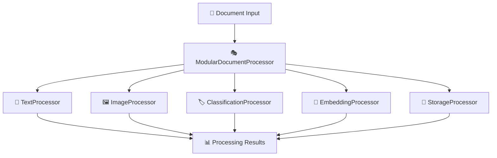

# 🚀 KR-AI-Engine - Production Ready

**Complete AI-Powered Document Processing Pipeline with 8-Stage Architecture**

[](https://github.com/Kunze-Ritter/KR-AI-Engine)
[](#architecture)
[](https://supabase.com)
[](https://cloudflare.com)
[](https://ollama.ai)
[](LICENSE)
[](https://github.com/Kunze-Ritter)

> **Production-ready AI document processing system with complete 8-stage pipeline for Kunze & Ritter GmbH**

---

## 📋 Inhaltsverzeichnis

- [🎯 Überblick](#überblick)
- [✨ Features](#features)  
- [🏗️ Architektur](#architektur)
- [🚀 Quick Start](#quick-start)
- [📖 Dokumentation](#dokumentation)
- [🛠️ Entwicklung](#entwicklung)
- [🤝 Contributing](#contributing)

---

## 🎯 Überblick

KR-AI-Engine ist ein vollständiges, production-ready KI-gestütztes Dokumentenverarbeitungssystem mit 8-stufiger Pipeline-Architektur. Es kombiniert Supabase Cloud, Ollama AI und Cloudflare R2 für eine hochperformante Dokumentenverarbeitung mit intelligenter Klassifizierung und Semantic Search.

### 🎯 Hauptziele (Production Setup)

- **🏗️ 8-Stage Pipeline** - Komplette Verarbeitungskette von Upload bis Search
- **☁️ Cloud-First** - Supabase Cloud, Cloudflare R2, Ollama AI
- **🔍 AI-Powered Classification** - Automatische Hersteller-/Modell-Erkennung
- **🖼️ Advanced Image Processing** - OCR, AI Vision, Format-Erhaltung
- **🔮 Semantic Search** - Vector-basierte Suche mit EmbeddingGemma
- **💾 Intelligent Storage** - Deduplication, R2 Integration, Database-only Documents
- **📊 Real-time Progress** - Advanced Progress Tracking mit ETA

---

## ✨ Features

### 🏗️ **8-Stage Processing Pipeline**
- **Stage 1: Upload Processor** - Document validation, hash generation, database storage
- **Stage 2: Text Processor** - PDF text extraction, intelligent chunking
- **Stage 3: Image Processor** - Image extraction, OCR, AI vision analysis
- **Stage 4: Classification Processor** - AI-powered manufacturer/model detection
- **Stage 5: Metadata Processor** - Error codes, version extraction
- **Stage 6: Storage Processor** - R2 object storage, deduplication
- **Stage 7: Embedding Processor** - Vector embedding generation
- **Stage 8: Search Processor** - Search index, analytics

### 🎯 **AI-Powered Intelligence**
- **Manufacturer Normalization** - HP, HP Inc. → HP Inc. (prevents duplicates)
- **Model Detection** - Extracts ALL models from documents (not just filename)
- **Document Classification** - Service manual, parts catalog, user manual detection
- **Vision AI** - OCR + AI analysis with Ollama llava model
- **Semantic Search** - Vector embeddings with embeddinggemma model

### 🔗 **Advanced Link Management**
- **PDF Page Mapping** - Automatische Zuordnung Adobe ↔ Actual Seitennummern
- **Link Deduplication** - Intelligente Duplikatserkennung mit Multi-Document References
- **Video Integration** - Automatische Integration in `instructional_videos` Tabelle
- **Cross-Document References** - Links mit Verweisen auf alle Fundstellen

### 🧠 **AI & Machine Learning**
- **Multi-Model Support** - Llama3.2, EmbeddingGemma, LLaVA Vision
- **Advanced Chunking** - 5 verschiedene Chunking-Strategien
- **Vector Search** - 768-dimensionale Embeddings mit HNSW-Index
- **Vision AI** - OCR, Diagrammanalyse, Defekterkennung

### 📄 **Dokumentenverarbeitung**
- **PDF Intelligence** - Text, Bilder, Metadaten-Extraktion
- **Hybrid Classification** - Filename + Content + LLM Analysis
- **Model Expansion** - Automatische Erweiterung von Modell-Platzhaltern
- **Version Detection** - Intelligente Versionserkennung

### 🗄️ **Enterprise Storage**
- **Supabase Integration** - PostgreSQL + Vector Extensions
- **Smart Deduplication** - Hash-basierte Duplikatserkennung
- **Image Routing** - Intelligente Speicherung nach Bildtyp
- **Audit Logging** - Vollständige Verarbeitungshistorie

---

## 🏗️ Architektur

### 🎭 **Modular Processing System**



### 🔧 **Core Components**

| Component | Beschreibung | Funktionen |
|-----------|--------------|------------|
| **📝 TextProcessor** | PDF-Textextraktion & Chunking | PyMuPDF, 5 Chunking-Strategien, Struktur-Analyse |
| **🖼️ ImageProcessor** | Bildverarbeitung & Vision AI | OCR, LLaVA Vision, Bildoptimierung |
| **🏷️ ClassificationProcessor** | Dokument-Klassifizierung | Hybrid-Ansatz, LLM-Integration |
| **🔮 EmbeddingProcessor** | Vector-Generierung | EmbeddingGemma, Batch-Processing, Deduplication |
| **💾 StorageProcessor** | Datenbank & Storage | Supabase, Hash-Deduplication, Smart Routing |

### 📊 **9-Stage Processing Pipeline**

1. **📤 Upload** - Dokumenten-Upload und Validierung
2. **📄 Text Extraction** - PDF-Text und Struktur-Analyse  
3. **🖼️ Image Processing** - Bildextraktion und OCR
4. **🏷️ Document Classification** - Typ, Hersteller, Modell-Erkennung
5. **📑 Metadata Extraction** - Version, Serie, Zusatzinfos
6. **💾 Document Storage** - Primäre Datenspeicherung
7. **🔪 Text Chunking** - Intelligente Textaufteilung
8. **🔮 Embedding Generation** - Vector-Erstellung für Semantic Search
9. **✅ Finalization** - Abschluss und Statusupdate

---

## 🚀 Quick Start (Minimal Setup)

### 📋 Voraussetzungen

- **Python** (v3.9+)
- **Git** (v2.30+)  
- **Ollama Windows App** (installiert und laufend)
- **Supabase Cloud Account** (kostenlos)
- **Cloudflare R2 Account** (optional)
- **4GB+ RAM** empfohlen
- **5GB+ freier Speicher**

### ⚡ Minimal Installation

#### 🎯 **Schritt 1: Repository klonen**
```bash
git clone https://github.com/Kunze-Ritter/KR-AI-Engine.git
cd KR-AI-Engine
```

> **💡 Hinweis**: Das Repository ist bereits mit einer fertigen `.env`-Datei konfiguriert! Sie können direkt loslegen.

#### 🎯 **Schritt 2: Environment konfigurieren**
```bash
# .env Datei ist bereits vorhanden und konfiguriert!
# Falls nötig, können Sie die Werte anpassen:
# - Supabase URL, API Keys
# - Cloudflare R2 Credentials  
# - Ollama Model Settings
```

> **✅ Bereits konfiguriert**: Die `.env`-Datei enthält bereits alle notwendigen Cloud-Credentials für sofortigen Start!

#### 🎯 **Schritt 3: Dependencies installieren**
```bash
# Minimal requirements installieren
pip install -r backend/requirements.txt
```

#### 🎯 **Schritt 4: Ollama Windows App starten**
```bash
# Ollama Windows App starten (manuell)
# Models herunterladen: llama3.2:3b, embeddinggemma, llava:7b
```

#### 🎯 **Schritt 5: System starten**
```bash
# Backend starten
cd backend
python main.py

# Oder mit PowerShell (Windows)
./start_krai.ps1
```

### 🧪 System testen

#### **Cloud Services:**
```bash
# Supabase Connection testen
curl https://your-project.supabase.co/rest/v1/

# Ollama Windows App testen
curl http://localhost:11434/api/tags

# KRAI API testen
curl http://localhost:8002/health
```

### 📄 Erstes Dokument verarbeiten

```bash
# Dokument über KRAI API verarbeiten
curl -X POST "http://localhost:8002/api/documents/upload" \
  -H "Content-Type: multipart/form-data" \
  -F "file=@your-service-manual.pdf"

# Oder direkt über Python Script
python backend/krai_main.py --demo your-document.pdf
```

---

## 📖 Dokumentation

### 🚀 **Migration & Deployment**

- **[📋 Migration Guide](migration/README.md)** - Alle Migration-Tools und Anleitungen
- **[🪟 Windows Migration](migration/documentation/WINDOWS_MIGRATION_GUIDE.md)** - Windows Laptop Setup
- **[🖥️ Server Migration](migration/documentation/DOCKER_PORTABILITY.md)** - Server-Migration Details
- **[⚙️ Deployment Options](migration/documentation/SERVER_DEPLOYMENT_OPTIONS.md)** - Alle Deployment-Optionen

### 📚 **System Dokumentation**

- **[🏗️ Architektur-Guide](documentation/ARCHITECTURE.md)** - Detaillierte System-Architektur
- **[🔧 API-Dokumentation](documentation/API.md)** - Vollständige API-Referenz
- **[🎭 Module-Dokumentation](documentation/MODULES.md)** - Prozessor-Module im Detail
- **[🚀 Deployment-Guide](documentation/DEPLOYMENT.md)** - Production Deployment
- **[⚙️ Konfiguration](documentation/CONFIGURATION.md)** - System-Konfiguration
- **[🧪 Testing-Guide](documentation/TESTING.md)** - Tests und Validierung
- **[📊 Performance](documentation/PERFORMANCE.md)** - Performance-Optimierung
- **[💾 Backup & Migration](documentation/BACKUP_AND_MIGRATION.md)** - Backup, Restore und Migration

### 🔗 **Quick Links (Minimal Setup)**

#### **Cloud Services:**
- **Supabase Studio**: https://supabase.com/dashboard (Database Management)
- **Supabase API**: https://your-project.supabase.co/rest/v1/ (Database API)
- **Cloudflare R2**: https://dash.cloudflare.com (Object Storage)

#### **Local Services:**
- **KRAI API**: http://localhost:8002 (Document Processing API)
- **Ollama**: http://localhost:11434 (AI Models - Windows App)
- **Supabase MCP**: Cursor Integration (Database Connection)

---

## 🛠️ Entwicklung

### 🏭 **Development Setup (Minimal)**

```bash
# Environment konfigurieren
cp .env.example .env
# .env mit Cloud-Credentials anpassen

# Dependencies installieren
pip install -r backend/requirements.txt

# Ollama Windows App starten
# Models herunterladen: llama3.2:3b, embeddinggemma, llava:7b

# Backend starten
cd backend
python main.py

# Logs verfolgen
# Backend Logs: Console Output
# Ollama Logs: Windows App Interface
# Supabase Logs: Cloud Dashboard
```

### 🔧 **Module entwickeln**

```python
# Neuen Processor erstellen
from modules.interfaces.base_processor import BaseProcessor

class CustomProcessor(BaseProcessor):
    async def process(self, data, context):
        # Your processing logic here
        return ProcessingResult(success=True, data=result)
```

### 📊 **Metriken & Monitoring (Minimal)**

```bash
# Processor-Metriken abrufen
curl http://localhost:8002/api/documents/stats/processing

# Live Processing Status  
curl http://localhost:8002/api/documents/sessions/active

# Supabase Database Stats (über MCP)
# Cursor → Supabase MCP → Database Queries

# Ollama Model Status
curl http://localhost:11434/api/tags
```

---

## 🏢 **Produktions-Deployment (Minimal)**

### ☁️ **Cloud-First Deployment**

```bash
# Environment für Production konfigurieren
cp .env.example .env.production

# Production Credentials eintragen:
# - Supabase Production URL & Keys
# - Cloudflare R2 Production Credentials
# - Ollama Production Models

# Backend als Service starten
python backend/main.py --production
```

### 🔒 **Security Checklist (Minimal)**

- ✅ Supabase Cloud Security aktiviert
- ✅ Cloudflare R2 Access Keys sicher gespeichert
- ✅ Ollama Windows App sicher konfiguriert
- ✅ Environment-Variablen verschlüsselt
- ✅ Supabase MCP sichere Verbindung

### 📈 **Skalierung (Cloud-First)**

- **Horizontal**: Mehrere Backend-Instanzen
- **Vertical**: CPU/Memory pro Instanz erhöhen
- **Database**: Supabase Cloud Auto-Scaling
- **Storage**: Cloudflare R2 Global CDN
- **AI**: Ollama Model Caching

---

## 🤝 Contributing

Wir freuen uns über Contributions! Bitte beachten Sie:

1. **Fork** das Repository
2. **Feature Branch** erstellen (`git checkout -b feature/amazing-feature`)
3. **Commit** Ihre Änderungen (`git commit -m 'Add amazing feature'`)
4. **Push** zum Branch (`git push origin feature/amazing-feature`)
5. **Pull Request** öffnen

### 📝 **Code Standards**

- **Python**: PEP 8, Type Hints, Async/Await
- **Docker**: Multi-stage builds, Security best practices
- **Tests**: Pytest, 80%+ Coverage
- **Documentation**: Inline comments, README updates

---

## 📄 **License**

Dieses Projekt steht unter der [MIT License](LICENSE).

```
Copyright (c) 2025 Kunze & Ritter GmbH

Permission is hereby granted, free of charge, to any person obtaining a copy
of this software and associated documentation files...
```

---

## 🏢 **Über Kunze & Ritter GmbH**

**Kunze & Ritter GmbH** ist spezialisiert auf innovative KI-Lösungen für technische Serviceumgebungen. Mit jahrzehntelanger Erfahrung in der Druckertechnik entwickeln wir cutting-edge Lösungen für die Zukunft des technischen Services.

---

## 📞 **Support & Kontakt**

- **📧 Email**: support@kunze-ritter.de
- **🌐 Website**: https://kunze-ritter.de
- **📱 Issues**: [GitHub Issues](https://github.com/your-org/kr-ai-engine/issues)
- **💬 Discussions**: [GitHub Discussions](https://github.com/your-org/kr-ai-engine/discussions)

---

<div align="center">

**🚀 Powered by Kunze & Ritter GmbH | Built with ❤️ for Technical Service Excellence**

</div>