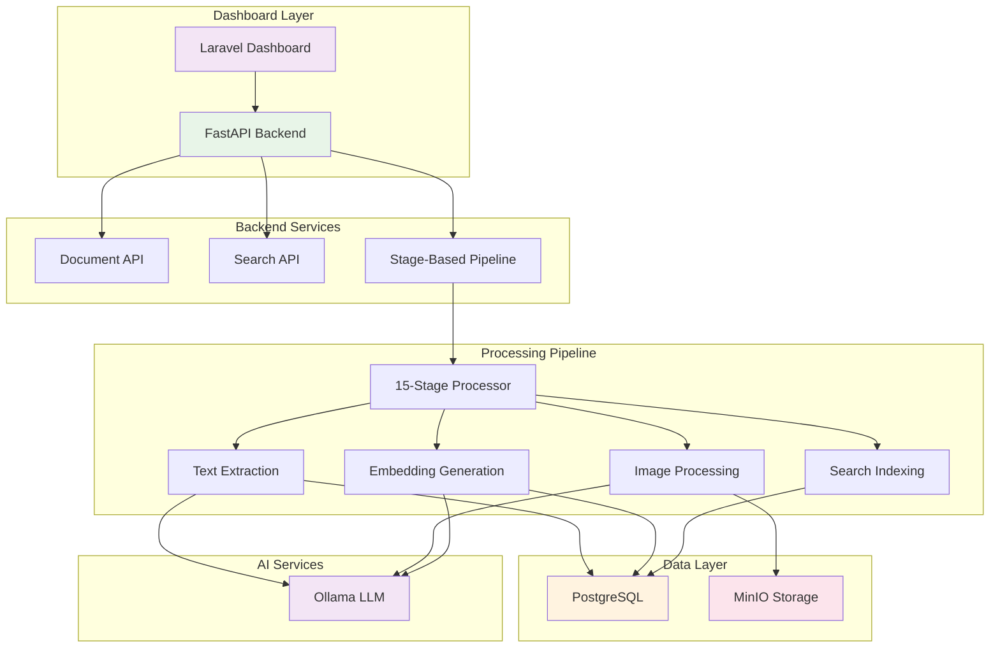
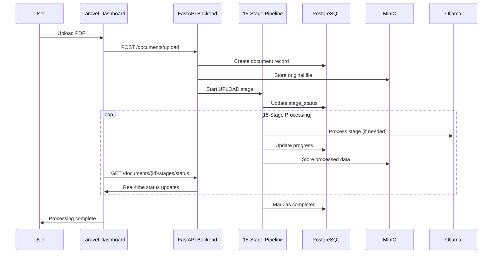
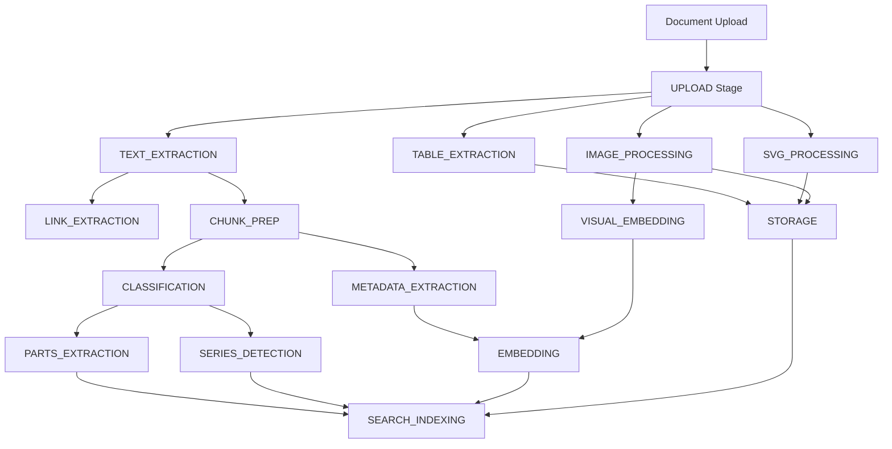

# KRAI System Architecture

## System Architecture Overview



The KRAI (Knowledge Retrieval and Intelligence) system is a comprehensive multimodal AI platform designed for technical document processing, knowledge extraction, and intelligent search. The architecture is built around a **15-stage modular pipeline** with PostgreSQL-only database design for complete data sovereignty.

## Database Layer

### PostgreSQL with pgvector (Primary Database)

The system uses PostgreSQL as the sole database, eliminating all cloud dependencies:

#### Schema Structure
- **`krai_core`** - Core document metadata and configuration
- **`krai_intelligence`** - Extracted intelligence (embeddings, chunks, error codes)
- **`krai_parts`** - Parts catalog and compatibility information
- **`krai_content`** - Content storage (images, links, tables)

#### Connection Architecture
- **Direct PostgreSQL** via `asyncpg` for async operations
- **Database Adapter Pattern** via `database_factory.py` → `postgresql_adapter.py`
- **Connection Pooling** for optimal performance
- **pgvector Extension** for vector similarity search

#### Key Features
- **Stage Status Tracking** - JSONB `stage_status` column for pipeline monitoring
- **Vector Search** - pgvector indexes for semantic search
- **Full-Text Search** - PostgreSQL tsvector indexes
- **ACID Compliance** - Reliable transaction handling

### Migration from Supabase (Completed)

> **ℹ️ Historical Reference:** This section is for historical reference only. All new deployments use PostgreSQL-only architecture.

- **Completed November 2024 (KRAI-002)**
- **All Supabase dependencies removed** from codebase
- **DatabaseAdapter interface** standardizes all database access (later removed - now using direct asyncpg pools)
- **Legacy Supabase scripts archived** to `archive/scripts/supabase/`

## Core Components

### 1. Service Layer

#### Document API

- Document upload and management
- Metadata extraction and storage
- Document processing orchestration
- Version control and history tracking

#### Search API

- Multimodal search across all content types
- Advanced filtering and faceted search
- Search analytics and optimization
- Result ranking and relevance scoring

#### Pipeline API

- Document processing workflow management
- Stage-by-stage processing monitoring
- Error handling and recovery mechanisms
- Performance metrics and optimization

#### Agent API

- AI-powered document analysis
- Intelligent content recommendations
- Automated troubleshooting assistance
- Context-aware query expansion

## Processing Pipeline

### 15-Stage Modular Architecture

The KRAI system uses a **15-stage modular pipeline** that provides granular control over document processing:

#### Stage Groups
- **Initialization** (1 stage): UPLOAD
- **Extraction** (5 stages): TEXT_EXTRACTION, TABLE_EXTRACTION, SVG_PROCESSING, IMAGE_PROCESSING, LINK_EXTRACTION
- **Processing** (5 stages): CHUNK_PREP, CLASSIFICATION, METADATA_EXTRACTION, PARTS_EXTRACTION, SERIES_DETECTION
- **Enrichment** (2 stages): VISUAL_EMBEDDING, EMBEDDING
- **Finalization** (2 stages): STORAGE, SEARCH_INDEXING

#### Stage Orchestration
- **`KRMasterPipeline`** in `backend/pipeline/master_pipeline.py`
- **Stage Tracking** via JSONB `stage_status` column in documents table
- **Execution Modes**: Full, Smart, Single, Multiple, Batch
- **Error Isolation** - One stage failure doesn't stop the entire pipeline
- **Dependency Management** - Automatic handling of stage prerequisites

#### Individual Processors
- **15 specialized processors** in `backend/processors/` directory
- **BaseProcessor interface** for consistent implementation
- **Stage-specific configuration** and optimization
- **Real-time status monitoring** and progress tracking

**Reference**: `docs/processor/PIPELINE_ARCHITECTURE.md` for detailed pipeline documentation

### 2. Processing Layer

#### Master Pipeline (Deprecated)

*The legacy 10-stage pipeline has been replaced by the 15-stage modular architecture*

#### Smart Chunker

- Intelligent text segmentation with context preservation
- Hierarchical structure detection and preservation
- Error code boundary detection
- Cross-chunk linking and relationship mapping

#### SVG Processor

- Vector graphics extraction from PDFs
- SVG to PNG conversion for Vision AI
- Technical diagram analysis and interpretation
- Vector graphics metadata extraction

#### Context Extractor

- Vision AI analysis for image content
- Video metadata and content extraction
- Link analysis and content summarization
- Table structure interpretation

### 3. Storage Layer

#### MinIO Object Storage (S3-Compatible)

MinIO is the sole object storage solution, providing S3-compatible local storage:

#### Buckets
- **`documents`** - Original PDF files and processed documents
- **`images`** - Extracted images, converted SVGs, and thumbnails
- **`parts`** - Parts catalog images and diagrams
- **`error`** - Error logs and diagnostic files

#### Features
- **Local-First Design** - Complete data sovereignty
- **Automatic Deduplication** - SHA256 hash-based file management
- **Version Control** - File versioning and rollback capability
- **Optional Cloud Migration** - S3-compatible for future cloud needs

#### Migration from Cloudflare R2
- **Completed November 2024 (KRAI-002)**
- **All R2 dependencies removed** from codebase
- **MinIO as default storage** for all new deployments

### 4. Data Layer

#### PostgreSQL with pgvector

- Primary database for structured data
- Vector similarity search capabilities
- ACID compliance for data integrity
- Advanced indexing and query optimization

#### MinIO/S3 Object Storage (Primary Storage)

- Scalable object storage for files and media
- Automatic deduplication using SHA256
- Version control and backup capabilities
- S3-compatible API for future cloud migration

#### Redis Cache (Optional)

- High-performance caching layer
- Session management and user state
- Query result caching for performance
- Real-time data synchronization

#### Ollama AI Service

- Local LLM and embedding model hosting
- Vision AI capabilities for image analysis
- Custom model deployment and management
- GPU acceleration support

## Data Flow Architecture

### Document Upload Flow



### Stage Execution Flow



### Search Query Flow

```text
User Query → Query Analysis → Embedding Generation → Database Search
     │               │                  │                    │
     ▼               ▼                  ▼                    ▼
 Query          Context            Vector              Similarity
 Expansion      Understanding      Generation           Search
     │               │                  │                    │
     ▼               ▼                  ▼                    ▼
 Modality      Query Enhancement  Model Selection    Result Ranking
 Filtering          │                  │                    │
     ▼              ▼                  ▼                    ▼
 Unified        Optimized          Batch              Result
 Search         Query              Processing         Enrichment
     │               │                  │                    │
     ▼               ▼                  ▼                    ▼
 Result         Response          Performance         Response
 Aggregation    Formatting        Monitoring          Delivery
```

## API Layer

### FastAPI with Async Support

The backend uses FastAPI with comprehensive async support:

#### Core Endpoints
- **Document Management**: `/documents/*` - Upload, list, delete documents
- **Stage-Based Processing**: `/documents/{id}/process/stage/{stage}` - Individual stage control
- **Multiple Stages**: `/documents/{id}/process/stages` - Batch stage execution
- **Status Monitoring**: `/documents/{id}/stages/status` - Real-time progress tracking
- **Search API**: `/search/*` - Semantic and multimodal search
- **Content APIs**: `/error-codes/*`, `/videos/*`, `/images/*` - Specialized content access

#### Authentication
- **JWT-based authentication** (not Supabase auth)
- **Role-based access control** for different user types
- **API key support** for service-to-service communication
- **Session management** with Redis (optional)

#### Stage-Based Features
- **Individual stage execution** with dependency checking
- **Smart processing** to skip completed stages
- **Error recovery** with retry mechanisms
- **Real-time status** via WebSocket connections

**Reference**: `docs/api/STAGE_BASED_PROCESSING.md` for detailed API documentation

## Dashboard Layer

### Laravel Filament Admin Panel

The Laravel dashboard provides comprehensive visual management:

#### Document Management
- **Upload Interface** with drag-and-drop support
- **Document Listing** with filtering and search
- **Metadata Editing** with manufacturer/model detection
- **Bulk Operations** for multiple document processing

#### Stage Control
- **Individual Stage Actions** - "Stage verarbeiten" dropdown
- **Multiple Stage Selection** - "Mehrere Stages verarbeiten" modal
- **Smart Processing** - Automatic stage selection based on completion status
- **Real-time Status** - Color-coded badges (green/yellow/red/gray)

#### Visual Features
- **Progress Tracking** with percentage completion
- **Error Display** with detailed messages and retry options
- **Performance Metrics** showing stage processing times
- **Resource Monitoring** for CPU, memory, and GPU usage

#### Integration Architecture
- **KraiEngineService** - Centralized FastAPI client
- **WebSocket Updates** - Real-time status without page refresh
- **Error Handling** - User-friendly error messages and recovery options
- **Bulk Processing** - Queue management for multiple documents

**Reference**: `docs/LARAVEL_DASHBOARD_INTEGRATION.md` for comprehensive dashboard guide

## Service Communication

### Synchronous Communication

#### REST APIs

- Standard HTTP/HTTPS protocols
- JSON request/response format
- OpenAPI documentation
- Version control and backward compatibility

#### GraphQL (Optional)

- Flexible query capabilities
- Reduced over-fetching/under-fetching
- Strong typing and validation
- Real-time subscriptions

### Asynchronous Communication

#### Message Queues

- Redis Pub/Sub for real-time events
- Background job processing
- Event-driven architecture
- Decoupled service communication

#### WebSocket Connections

- Real-time status updates
- Live search results
- Interactive document processing
- Bidirectional communication

## Security Architecture

### Authentication & Authorization

#### JWT Token System

- Stateless authentication
- Role-based access control
- Token expiration and refresh
- Multi-factor authentication support

#### OAuth2 Integration

- Third-party authentication providers
- Enterprise SSO support
- API key management
- Service-to-service authentication

### Data Security

#### Encryption at Rest

- Database encryption with AES-256
- Object storage encryption
- Key management with rotation
- Backup encryption and verification

#### Encryption in Transit

- TLS 1.3 for all communications
- Certificate management
- Mutual TLS for service communication
- VPN support for secure access

### Access Control

#### Role-Based Access Control (RBAC)

- User roles and permissions
- Resource-level access control
- Dynamic permission evaluation
- Audit logging and compliance

#### API Security

- Rate limiting and throttling
- Input validation and sanitization
- SQL injection prevention
- XSS protection mechanisms

## Scalability Architecture

### Horizontal Scaling

#### Service Scaling

- Containerized services with Docker
- Kubernetes orchestration (optional)
- Load balancing with Nginx
- Auto-scaling based on metrics

#### Database Scaling

- Read replicas for query distribution
- Connection pooling optimization
- Sharding strategies for large datasets
- Caching layers for performance

#### Storage Scaling

- Distributed object storage
- CDN integration for content delivery
- Automatic backup and replication
- Storage tiering based on access patterns

### Performance Optimization

#### Caching Strategy

- Multi-level caching architecture
- Intelligent cache invalidation
- Cache warming strategies
- Performance monitoring

#### Query Optimization

- Vector indexing with pgvector
- Query plan optimization
- Materialized views for complex queries
- Database connection pooling

#### AI Service Optimization

- Model batching for throughput
- GPU acceleration for Vision AI
- Model quantization for efficiency
- Edge computing for low latency

## Monitoring & Observability

### Metrics Collection

#### Application Metrics

- Request/response times
- Error rates and types
- Processing pipeline performance
- Resource utilization

#### Infrastructure Metrics

- CPU, memory, disk usage
- Network latency and throughput
- Database performance metrics
- Storage utilization and growth

#### Business Metrics

- Document processing volume
- Search query patterns
- User engagement metrics
- Content quality indicators

### Logging Architecture

#### Structured Logging

- JSON format for log aggregation
- Correlation IDs for request tracing
- Log levels and filtering
- Centralized log collection

#### Log Analysis

- ELK Stack (Elasticsearch, Logstash, Kibana)
- Real-time log monitoring
- Alert configuration and notification
- Log retention and archival

### Distributed Tracing

#### Request Tracing

- OpenTelemetry integration
- Service dependency mapping
- Performance bottleneck identification
- Error propagation tracking

## Deployment Architecture

### Container Strategy

#### Docker Containers

- Multi-stage builds for optimization
- Security scanning and vulnerability assessment
- Image versioning and rollback
- Health checks and monitoring

#### Docker Compose

- Local development environment
- Service orchestration and dependencies
- Environment configuration management
- Volume management and persistence

### Production Deployment

#### Kubernetes (Optional)

- Container orchestration at scale
- Service discovery and load balancing
- Rolling updates and rollback
- Resource management and limits

#### Cloud Integration

- AWS/Azure/GCP compatibility
- Managed database services
- CDN and edge computing
- Disaster recovery and backup

## Development Architecture

### Code Organization

#### Monorepo Structure

- Shared libraries and utilities
- Independent service development
- Consistent coding standards
- Automated testing and quality gates

#### API Design

- OpenAPI specification
- Version control strategy
- Backward compatibility
- Documentation generation

### Testing Strategy

#### Unit Testing

- Service-level test coverage
- Mock external dependencies
- Test data management
- Continuous integration testing

#### Integration Testing

- End-to-end workflow testing
- Database integration testing
- External service mocking
- Performance testing automation

#### Quality Assurance

- Code review processes
- Static code analysis
- Security vulnerability scanning
- Performance benchmarking

## Configuration Management

### Environment Configuration

#### Environment Variables

- Service-specific configuration
- Secret management
- Feature flags and toggles
- Runtime parameter tuning

#### Configuration Files

- YAML/JSON configuration formats
- Schema validation
- Configuration templates
- Environment-specific overrides

### Feature Flags

#### Dynamic Configuration

- Runtime feature enablement
- A/B testing support
- Gradual rollout strategies
- Emergency feature disabling

## Disaster Recovery

### Backup Strategy

#### Database Backups

- Automated daily backups
- Point-in-time recovery
- Cross-region replication
- Backup verification and testing

#### Object Storage Backups

- Version control integration
- Cross-region replication
- Lifecycle management
- Data integrity verification

### High Availability

#### Service Redundancy

- Multi-instance deployment
- Load balancing and failover
- Health monitoring and recovery
- Graceful degradation

#### Data Redundancy

- Database replication
- Storage replication
- Geographic distribution
- Consistency management

## Evolution Strategy

### Technology Roadmap

#### Current Technologies

- Python 3.11+ for backend services
- Laravel 10+ with Filament 3+ for dashboard
- PostgreSQL 15+ with pgvector
- Docker and Docker Compose

#### Future Enhancements

- Microservices with FastAPI
- GraphQL API gateway
- Advanced AI model integration
- Edge computing capabilities

### Migration Path

#### Gradual Migration

- Backward compatibility maintenance
- Feature flag-based rollout
- Data migration strategies
- Performance monitoring

#### Legacy Support

- API versioning strategy
- Data format compatibility
- Client migration guidance
- Deprecation communication

---

## Conclusion

The KRAI system architecture provides a robust, scalable, and maintainable foundation for multimodal AI document processing. The modular design enables independent development and deployment of components while maintaining system coherence and performance.

Key architectural principles:
- **Modularity**: Independent, loosely coupled services
- **Scalability**: Horizontal and vertical scaling capabilities
- **Reliability**: Fault tolerance and disaster recovery
- **Security**: Comprehensive security measures at all layers
- **Performance**: Optimized for high-throughput processing
- **Observability**: Comprehensive monitoring and debugging capabilities

This architecture supports the current Phase 6 advanced features while providing a solid foundation for future enhancements and scale requirements.
