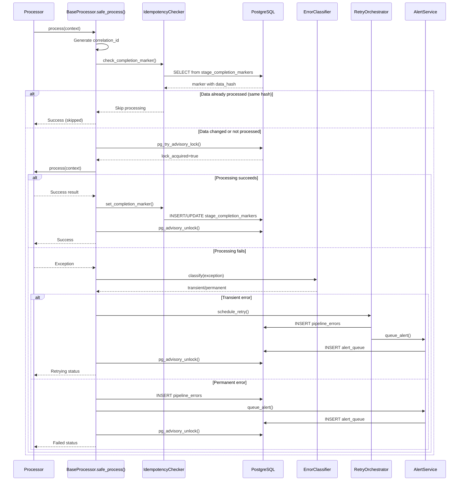

# Error Handling & Retry Architecture Rules

**This document extends the project rules with comprehensive error handling and retry patterns.**

---

## 🔄 Error Handling & Retry Patterns (CRITICAL!)

**ALWAYS use `BaseProcessor.safe_process()` for all processing logic!**

### Rule 1: ALWAYS use BaseProcessor.safe_process()

**NEVER implement custom retry logic in processors!**

All retry logic is centralized in `BaseProcessor.safe_process()` method. This ensures:
- Consistent error handling across all processors
- Centralized retry orchestration
- Proper correlation ID tracking
- Idempotency checks
- Advisory lock management

**✅ CORRECT:**
```python
class MyProcessor(BaseProcessor):
    def process(self, context: ProcessingContext) -> ProcessingResult:
        # Your processing logic here
        # No try/except needed - safe_process() handles it
        result = self.do_work(context)
        return ProcessingResult(success=True, data=result)
```

**❌ WRONG:**
```python
class MyProcessor(BaseProcessor):
    def process(self, context: ProcessingContext) -> ProcessingResult:
        # NEVER implement custom retry loops!
        for attempt in range(3):
            try:
                result = self.do_work(context)
                return ProcessingResult(success=True, data=result)
            except Exception as e:
                if attempt < 2:
                    time.sleep(2 ** attempt)  # ❌ WRONG!
                    continue
                raise
```

### Rule 2: Error Classification

**Errors MUST be classified as transient or permanent!**

Use `ErrorClassifier` to determine retry behavior:

**Transient Errors (WILL be retried):**
- HTTP 5xx (500, 502, 503, 504)
- `ConnectionError`, `TimeoutError`
- `requests.exceptions.Timeout`
- `requests.exceptions.ConnectionError`
- Database connection errors
- Rate limit errors (429)

**Permanent Errors (NO retry):**
- HTTP 4xx (400, 401, 403, 404)
- `ValidationError`
- `AuthenticationError`
- `PermissionError`
- Malformed input data
- Missing required fields

**✅ CORRECT:**
```python
from backend.core.error_classifier import ErrorClassifier

classifier = ErrorClassifier()

try:
    response = requests.get(url, timeout=30)
    response.raise_for_status()
except requests.exceptions.HTTPError as e:
    error_type = classifier.classify(e)
    if error_type == "transient":
        # Will be retried by safe_process()
        raise ProcessingError(f"Transient HTTP error: {e}", processor_name=self.name)
    else:
        # Permanent error - no retry
        raise ProcessingError(f"Permanent HTTP error: {e}", processor_name=self.name)
```

**❌ WRONG:**
```python
try:
    response = requests.get(url)
except Exception as e:
    # ❌ WRONG: No error classification!
    # ❌ WRONG: Catching all exceptions!
    raise ProcessingError(str(e))
```

### Rule 3: Exception Handling

**ALWAYS raise `ProcessingError` with descriptive messages!**

**✅ CORRECT:**
```python
from backend.processors.exceptions import ProcessingError

try:
    result = external_api.call(data)
except requests.exceptions.Timeout as e:
    raise ProcessingError(
        f"API timeout after 30s for document {context.document_id}",
        processor_name=self.name,
        original_exception=e
    )
except ValueError as e:
    raise ProcessingError(
        f"Invalid data format: {e}",
        processor_name=self.name,
        original_exception=e
    )
```

**❌ WRONG:**
```python
try:
    result = external_api.call(data)
except Exception as e:
    # ❌ WRONG: Generic exception catch
    # ❌ WRONG: No processor name
    # ❌ WRONG: No context
    raise Exception(str(e))
```

### Rule 4: Hybrid Retry Approach

**First retry synchronous, subsequent retries asynchronous!**

- **Retry 1:** Synchronous with 1s wait (fast recovery for transient blips)
- **Retry 2+:** Asynchronous background tasks (exponential backoff: 2s, 4s, 8s)

This is handled automatically by `BaseProcessor.safe_process()` - you don't need to implement it!

**Flow:**
1. First attempt fails with transient error
2. Wait 1 second
3. Retry synchronously (attempt 2)
4. If still fails, schedule async retry with 2s delay
5. Background worker picks up retry task
6. Exponential backoff for subsequent retries

### Rule 5: Never catch generic exceptions

**ALWAYS catch specific exception types!**

**✅ CORRECT:**
```python
try:
    data = json.loads(response.text)
except json.JSONDecodeError as e:
    raise ProcessingError(f"Invalid JSON response: {e}", processor_name=self.name)
except requests.exceptions.Timeout as e:
    raise ProcessingError(f"Request timeout: {e}", processor_name=self.name)
except requests.exceptions.ConnectionError as e:
    raise ProcessingError(f"Connection failed: {e}", processor_name=self.name)
```

**❌ WRONG:**
```python
try:
    data = json.loads(response.text)
except Exception as e:
    # ❌ WRONG: Catches everything including KeyboardInterrupt!
    raise ProcessingError(str(e))
```

---

## 🔁 Idempotency Guidelines (CRITICAL!)

**ALWAYS check completion markers before processing!**

### Rule 1: Check-Before-Write Pattern

**NEVER process without checking `stage_completion_markers` first!**

**✅ CORRECT:**
```python
from backend.core.idempotency_checker import IdempotencyChecker

class MyProcessor(BaseProcessor):
    def process(self, context: ProcessingContext) -> ProcessingResult:
        checker = IdempotencyChecker(self.db_adapter)
        
        # Check if already processed
        is_complete, data_hash = checker.check_completion_marker(
            document_id=context.document_id,
            stage_name=self.name
        )
        
        if is_complete:
            # Compute current data hash
            current_hash = checker.compute_data_hash(context.data)
            
            if current_hash == data_hash:
                # Same data - skip processing
                self.logger.info(f"Stage {self.name} already completed with same data")
                return ProcessingResult(success=True, skipped=True)
            else:
                # Data changed - cleanup and re-process
                self.logger.info(f"Data changed - cleaning up old data")
                self.cleanup_old_data(context.document_id)
        
        # Process the data
        result = self.do_work(context)
        
        # Set completion marker
        checker.set_completion_marker(
            document_id=context.document_id,
            stage_name=self.name,
            data_hash=checker.compute_data_hash(context.data)
        )
        
        return ProcessingResult(success=True, data=result)
```

**❌ WRONG:**
```python
class MyProcessor(BaseProcessor):
    def process(self, context: ProcessingContext) -> ProcessingResult:
        # ❌ WRONG: No idempotency check!
        # This will create duplicate data on retries!
        result = self.do_work(context)
        return ProcessingResult(success=True, data=result)
```

### Rule 2: Data Hash Verification

**ALWAYS compute SHA256 hash of input data!**

The data hash is used to detect if the input data has changed since the last successful processing.

**✅ CORRECT:**
```python
import hashlib
import json

def compute_data_hash(data: dict) -> str:
    """Compute SHA256 hash of input data."""
    # Sort keys for consistent hashing
    data_str = json.dumps(data, sort_keys=True)
    return hashlib.sha256(data_str.encode()).hexdigest()
```

### Rule 3: Cleanup Old Data

**If data hash changed, cleanup old data before re-processing!**

**✅ CORRECT:**
```python
def cleanup_old_data(self, document_id: str):
    """Remove old processing results before re-processing."""
    # Delete old chunks
    self.db_adapter.execute(
        "DELETE FROM krai_intelligence.chunks WHERE document_id = %s",
        (document_id,)
    )
    # Delete old images
    self.db_adapter.execute(
        "DELETE FROM krai_content.images WHERE document_id = %s",
        (document_id,)
    )
    self.logger.info(f"Cleaned up old data for document {document_id}")
```

**❌ WRONG:**
```python
def process(self, context: ProcessingContext) -> ProcessingResult:
    # ❌ WRONG: No cleanup - will create duplicate data!
    result = self.do_work(context)
    return ProcessingResult(success=True, data=result)
```

### Rule 4: Set Completion Marker

**ALWAYS set completion marker after successful processing!**

**✅ CORRECT:**
```python
# After successful processing
checker.set_completion_marker(
    document_id=context.document_id,
    stage_name=self.name,
    data_hash=checker.compute_data_hash(context.data),
    metadata={
        "chunks_created": len(chunks),
        "processing_time_ms": processing_time
    }
)
```

### Pattern Flow

```
1. Check completion marker
   ↓
2. If complete:
   - Compute current data hash
   - Compare with stored hash
   - If same: SKIP processing
   - If different: Cleanup old data
   ↓
3. Process data
   ↓
4. Set completion marker with new hash
```

**Database Table:** `krai_system.stage_completion_markers`

```sql
CREATE TABLE krai_system.stage_completion_markers (
    id UUID PRIMARY KEY DEFAULT gen_random_uuid(),
    document_id UUID NOT NULL REFERENCES krai_core.documents(id),
    stage_name VARCHAR(100) NOT NULL,
    completed_at TIMESTAMP NOT NULL DEFAULT NOW(),
    data_hash VARCHAR(64) NOT NULL,  -- SHA256 hash
    metadata JSONB,
    UNIQUE(document_id, stage_name)
);
```

---

## 🔍 Correlation ID & Tracing (CRITICAL!)

**EVERY log entry MUST include correlation_id!**

### Format

**Hierarchical format:** `req_{uuid}.stage_{name}.retry_{n}`

**Examples:**
- Request ID: `req_a3f2e8d1-4b2c-4a5e-8f3d-9c1e2b3a4d5e`
- Stage ID: `req_a3f2e8d1.stage_image_processing`
- Retry ID: `req_a3f2e8d1.stage_image_processing.retry_2`

### Rule 1: Generate correlation ID

**Generate at start of `safe_process()` using request_id + stage_name + retry_attempt!**

**✅ CORRECT:**
```python
def safe_process(self, context: ProcessingContext) -> ProcessingResult:
    # Generate correlation ID
    correlation_id = f"req_{context.request_id}.stage_{self.name}"
    if context.retry_attempt > 0:
        correlation_id += f".retry_{context.retry_attempt}"
    
    # Add to context
    context.correlation_id = correlation_id
    
    self.logger.info(f"[{correlation_id}] Starting {self.name} processing")
```

**❌ WRONG:**
```python
def safe_process(self, context: ProcessingContext) -> ProcessingResult:
    # ❌ WRONG: Random UUID without hierarchy
    correlation_id = str(uuid.uuid4())
    
    # ❌ WRONG: No stage name or retry info
    self.logger.info(f"Starting processing")
```

### Rule 2: Include in ALL logs

**Every log entry must include correlation_id!**

**✅ CORRECT:**
```python
self.logger.info(f"[{correlation_id}] Processing document {document_id}")
self.logger.debug(f"[{correlation_id}] Extracted {len(chunks)} chunks")
self.logger.error(f"[{correlation_id}] Failed to process: {error}")
```

**❌ WRONG:**
```python
# ❌ WRONG: No correlation ID
self.logger.info(f"Processing document {document_id}")
self.logger.error(f"Failed to process: {error}")
```

### Rule 3: Pass through pipeline

**Correlation ID must flow through all stages!**

**✅ CORRECT:**
```python
# In pipeline orchestrator
context = ProcessingContext(
    document_id=document_id,
    request_id=request_id,  # Same request_id for all stages
    data=data
)

# Each stage gets same request_id
for stage in pipeline_stages:
    result = stage.safe_process(context)
    # Correlation ID: req_xxx.stage_pdf_extraction
    # Correlation ID: req_xxx.stage_image_processing
    # Correlation ID: req_xxx.stage_embedding_generation
```

### Rule 4: Use for debugging

**Grep logs by correlation_id to trace request flow!**

```bash
# Trace entire request
grep "req_a3f2e8d1" logs/pipeline.log

# Trace specific stage
grep "req_a3f2e8d1.stage_image_processing" logs/pipeline.log

# Trace specific retry
grep "req_a3f2e8d1.stage_image_processing.retry_2" logs/pipeline.log
```

**Structured logging format:**
```json
{
  "timestamp": "2026-01-12T14:30:45.123Z",
  "level": "INFO",
  "correlation_id": "req_a3f2e8d1.stage_image_processing.retry_2",
  "processor": "ImageProcessor",
  "document_id": "doc_123",
  "message": "Processing 15 images",
  "metadata": {
    "retry_attempt": 2,
    "processing_time_ms": 1250
  }
}
```

---

## 🔒 PostgreSQL Advisory Locks (CRITICAL!)

**ALWAYS use try-finally block to ensure locks are released!**

### Purpose

**Prevent concurrent retries of the same stage for the same document!**

Without advisory locks:
- Retry 1 starts processing
- Retry 2 starts processing (race condition!)
- Both create duplicate data

With advisory locks:
- Retry 1 acquires lock and processes
- Retry 2 tries to acquire lock, fails, and skips (another retry in progress)

### Rule 1: ALWAYS use try-finally block

**Ensure locks are released even on error!**

**✅ CORRECT:**
```python
def safe_process(self, context: ProcessingContext) -> ProcessingResult:
    lock_id = self.compute_lock_id(context.document_id, self.name)
    lock_acquired = False
    
    try:
        # Try to acquire lock (non-blocking)
        lock_acquired = self.db_adapter.execute_scalar(
            "SELECT pg_try_advisory_lock(%s)",
            (lock_id,)
        )
        
        if not lock_acquired:
            if context.retry_attempt > 0:
                # Another retry is in progress
                self.logger.info(f"Lock not acquired - another retry in progress")
                return ProcessingResult(success=True, skipped=True)
            else:
                # First attempt - should always get lock
                raise ProcessingError("Failed to acquire lock on first attempt")
        
        # Process with lock held
        result = self.process(context)
        return result
        
    finally:
        # ALWAYS release lock
        if lock_acquired:
            self.db_adapter.execute(
                "SELECT pg_advisory_unlock(%s)",
                (lock_id,)
            )
```

**❌ WRONG:**
```python
def safe_process(self, context: ProcessingContext) -> ProcessingResult:
    lock_id = self.compute_lock_id(context.document_id, self.name)
    
    # ❌ WRONG: No try-finally - lock may not be released!
    lock_acquired = self.db_adapter.execute_scalar(
        "SELECT pg_try_advisory_lock(%s)",
        (lock_id,)
    )
    
    result = self.process(context)
    
    # ❌ WRONG: If exception occurs, lock is never released!
    self.db_adapter.execute(
        "SELECT pg_advisory_unlock(%s)",
        (lock_id,)
    )
    
    return result
```

### Rule 2: Use pg_try_advisory_lock()

**Non-blocking lock acquisition!**

- `pg_advisory_lock()` - Blocking (waits forever) ❌
- `pg_try_advisory_lock()` - Non-blocking (returns immediately) ✅

**✅ CORRECT:**
```python
# Non-blocking - returns True/False immediately
lock_acquired = db.execute_scalar(
    "SELECT pg_try_advisory_lock(%s)",
    (lock_id,)
)
```

**❌ WRONG:**
```python
# ❌ WRONG: Blocking - will wait forever if another process holds lock!
db.execute("SELECT pg_advisory_lock(%s)", (lock_id,))
```

### Rule 3: Lock ID from document + stage

**Compute lock ID from document_id and stage_name!**

**✅ CORRECT:**
```python
def compute_lock_id(self, document_id: str, stage_name: str) -> int:
    """Compute PostgreSQL advisory lock ID."""
    # Combine document_id and stage_name
    lock_key = f"{document_id}:{stage_name}"
    
    # Hash to 32-bit integer (PostgreSQL advisory lock range)
    hash_value = int(hashlib.sha256(lock_key.encode()).hexdigest(), 16)
    
    # Modulo to fit in 32-bit signed integer range
    return hash_value % (2**31)
```

**Example:**
- Document: `doc_a3f2e8d1`
- Stage: `image_processing`
- Lock key: `doc_a3f2e8d1:image_processing`
- Lock ID: `1234567890` (32-bit integer)

### Rule 4: Check lock acquisition

**If lock not acquired and retry > 0, another retry is in progress!**

**✅ CORRECT:**
```python
if not lock_acquired:
    if context.retry_attempt > 0:
        # Another retry is already processing this stage
        self.logger.info(
            f"[{correlation_id}] Lock not acquired - "
            f"another retry is in progress for {self.name}"
        )
        return ProcessingResult(success=True, skipped=True, reason="concurrent_retry")
    else:
        # First attempt should always get lock
        raise ProcessingError(
            f"Failed to acquire lock on first attempt for {self.name}",
            processor_name=self.name
        )
```

### Rule 5: Release with pg_advisory_unlock()

**In finally block!**

**✅ CORRECT:**
```python
finally:
    if lock_acquired:
        self.db_adapter.execute(
            "SELECT pg_advisory_unlock(%s)",
            (lock_id,)
        )
        self.logger.debug(f"[{correlation_id}] Released advisory lock {lock_id}")
```

---

## 🚨 Alert-Service Integration (CRITICAL!)

**NEVER send emails/Slack directly from processors!**

### Rule 1: NEVER send emails/Slack directly

**ALWAYS use `AlertService.queue_alert()`!**

**✅ CORRECT:**
```python
from backend.services.alert_service import AlertService

alert_service = AlertService(db_adapter)

# Queue alert - will be aggregated and sent by background worker
alert_service.queue_alert(
    alert_type="processing_error",
    severity="high",
    title=f"Processing failed for {self.name}",
    message=f"Document {document_id} failed after {retry_attempt} retries",
    metadata={
        "document_id": document_id,
        "stage_name": self.name,
        "error_message": str(error),
        "retry_attempt": retry_attempt
    }
)
```

**❌ WRONG:**
```python
import smtplib

# ❌ WRONG: Sending email directly from processor!
# This bypasses aggregation and rate limiting!
msg = f"Processing failed for {document_id}"
smtp.sendmail("alerts@example.com", ["admin@example.com"], msg)
```

### Rule 2: Queue-based aggregation

**Alerts are queued in `alert_queue` table!**

Background worker processes queue every 1 minute and aggregates alerts by:
- Alert type
- Time window (5 minutes)
- Severity

**Example aggregation:**
- 10 "processing_error" alerts in 5 minutes
- Aggregated into 1 email: "10 processing errors in the last 5 minutes"

**Database Table:** `krai_system.alert_queue`

```sql
CREATE TABLE krai_system.alert_queue (
    id UUID PRIMARY KEY DEFAULT gen_random_uuid(),
    alert_type VARCHAR(50) NOT NULL,
    severity VARCHAR(20) NOT NULL,  -- low, medium, high, critical
    title VARCHAR(200) NOT NULL,
    message TEXT NOT NULL,
    metadata JSONB,
    created_at TIMESTAMP NOT NULL DEFAULT NOW(),
    processed_at TIMESTAMP,
    sent_at TIMESTAMP,
    status VARCHAR(20) DEFAULT 'pending'  -- pending, aggregated, sent, failed
);
```

### Rule 3: Background worker processes queue

**Runs every 1 minute, aggregates by time window!**

**Worker logic:**
```python
# Pseudo-code for alert worker
def process_alert_queue():
    # Get pending alerts from last 5 minutes
    alerts = db.query(
        "SELECT * FROM krai_system.alert_queue "
        "WHERE status = 'pending' AND created_at > NOW() - INTERVAL '5 minutes'"
    )
    
    # Group by alert_type and severity
    grouped = group_by(alerts, ['alert_type', 'severity'])
    
    for group_key, group_alerts in grouped.items():
        if len(group_alerts) >= threshold:
            # Send aggregated alert
            send_alert(
                title=f"{len(group_alerts)} {group_key} alerts",
                alerts=group_alerts
            )
            
            # Mark as sent
            db.execute(
                "UPDATE krai_system.alert_queue SET status = 'sent', sent_at = NOW() "
                "WHERE id = ANY(%s)",
                ([a.id for a in group_alerts],)
            )
```

### Rule 4: Configuration in database

**Alert rules stored in `alert_configurations` table!**

**Database Table:** `krai_system.alert_configurations`

```sql
CREATE TABLE krai_system.alert_configurations (
    id UUID PRIMARY KEY DEFAULT gen_random_uuid(),
    alert_type VARCHAR(50) NOT NULL UNIQUE,
    enabled BOOLEAN DEFAULT true,
    threshold INT NOT NULL DEFAULT 1,  -- Min count to trigger alert
    time_window_minutes INT NOT NULL DEFAULT 5,
    channels JSONB NOT NULL,  -- ["email", "slack"]
    recipients JSONB NOT NULL,  -- {"email": [...], "slack": [...]}
    created_at TIMESTAMP NOT NULL DEFAULT NOW(),
    updated_at TIMESTAMP NOT NULL DEFAULT NOW()
);
```

**Example configuration:**
```json
{
  "alert_type": "processing_error",
  "enabled": true,
  "threshold": 5,
  "time_window_minutes": 5,
  "channels": ["email", "slack"],
  "recipients": {
    "email": ["admin@example.com", "ops@example.com"],
    "slack": ["#alerts", "#ops"]
  }
}
```

### Rule 5: Threshold-based sending

**Only send if error count >= threshold!**

**✅ CORRECT:**
```python
# Alert configuration
config = {
    "processing_error": {
        "threshold": 5,
        "time_window_minutes": 5
    }
}

# Worker checks threshold
error_count = count_alerts("processing_error", last_5_minutes)
if error_count >= config["processing_error"]["threshold"]:
    send_aggregated_alert(error_count, alerts)
```

**Benefits:**
- Reduces alert fatigue
- Aggregates related errors
- Rate limiting built-in
- Configurable per alert type

---

## 📊 Performance Measurement (CRITICAL!)

**NEVER run benchmarks in production!**

### Rule 1: NEVER run benchmarks in production

**Use staging environment only!**

**Why:**
- Benchmarks consume resources
- May impact production performance
- Can cause timeouts or errors
- Skews production metrics

**✅ CORRECT:**
```bash
# Run benchmarks in staging
docker-compose -f docker-compose.staging.yml up -d
python scripts/run_benchmark.py --env staging
```

**❌ WRONG:**
```bash
# ❌ WRONG: Running benchmarks in production!
python scripts/run_benchmark.py --env production
```

### Rule 2: Fixed test documents

**Use same documents for baseline and comparison!**

**✅ CORRECT:**
```python
# Fixed test documents for benchmarking
BENCHMARK_DOCUMENTS = [
    "Brother_HL-L8360CDW_UM_ENG.pdf",  # Small: 50 pages
    "HP_E877_CPMD.pdf",  # Large: 1116 pages
    "Canon_MF644Cdw_UM.pdf"  # Medium: 200 pages
]

# Run benchmark with same documents
for doc in BENCHMARK_DOCUMENTS:
    result = run_pipeline(doc)
    store_baseline(doc, result.metrics)
```

**❌ WRONG:**
```python
# ❌ WRONG: Random documents - results not comparable!
docs = get_random_documents(3)
for doc in docs:
    result = run_pipeline(doc)
```

### Rule 3: Staging environment setup

**Separate docker-compose.staging.yml!**

**File:** `docker-compose.staging.yml`

```yaml
version: '3.8'

services:
  krai-engine-staging:
    build:
      context: .
      dockerfile: Dockerfile
    environment:
      - ENVIRONMENT=staging
      - POSTGRES_URL=${STAGING_POSTGRES_URL}
      - OLLAMA_HOST=${STAGING_OLLAMA_HOST}
    volumes:
      - ./data/staging:/app/data
    networks:
      - krai-staging

  postgres-staging:
    image: pgvector/pgvector:pg15
    environment:
      - POSTGRES_DB=krai_staging
      - POSTGRES_USER=krai_staging
      - POSTGRES_PASSWORD=${STAGING_DB_PASSWORD}
    volumes:
      - postgres-staging-data:/var/lib/postgresql/data
    networks:
      - krai-staging

networks:
  krai-staging:
    driver: bridge

volumes:
  postgres-staging-data:
```

### Rule 4: Data snapshot process

**Anonymize production data for staging!**

**Script:** `scripts/create_staging_snapshot.sh`

```bash
#!/bin/bash

# Export production data (anonymized)
pg_dump -h prod-db -U krai_prod krai_prod \
  --exclude-table=krai_users.users \
  --exclude-table=krai_system.alert_queue \
  > staging_snapshot.sql

# Anonymize sensitive data
sed -i 's/[a-zA-Z0-9._%+-]+@[a-zA-Z0-9.-]+\.[a-zA-Z]{2,}/user@example.com/g' staging_snapshot.sql

# Import to staging
psql -h staging-db -U krai_staging krai_staging < staging_snapshot.sql

echo "Staging snapshot created and anonymized"
```

### Rule 5: Measure before and after

**Store baselines in `performance_baselines` table!**

**Database Table:** `krai_system.performance_baselines`

```sql
CREATE TABLE krai_system.performance_baselines (
    id UUID PRIMARY KEY DEFAULT gen_random_uuid(),
    test_name VARCHAR(100) NOT NULL,
    document_name VARCHAR(200) NOT NULL,
    git_commit VARCHAR(40) NOT NULL,
    environment VARCHAR(20) NOT NULL,  -- staging, production
    metrics JSONB NOT NULL,
    created_at TIMESTAMP NOT NULL DEFAULT NOW(),
    UNIQUE(test_name, document_name, git_commit)
);
```

**Example metrics:**
```json
{
  "pipeline_time_ms": 45000,
  "stages": {
    "pdf_extraction": 5000,
    "image_processing": 15000,
    "chunk_preprocessing": 8000,
    "embedding_generation": 12000,
    "classification": 5000
  },
  "database_queries": {
    "total_time_ms": 2500,
    "query_count": 150
  },
  "api_calls": {
    "ollama": {"count": 50, "total_time_ms": 8000},
    "perplexity": {"count": 5, "total_time_ms": 3000}
  },
  "throughput_docs_per_hour": 80
}
```

**Benchmark script:**
```python
# scripts/run_benchmark.py
def run_benchmark(document_path: str, git_commit: str):
    # Run pipeline and collect metrics
    start_time = time.time()
    result = pipeline.process(document_path)
    total_time = (time.time() - start_time) * 1000
    
    # Store baseline
    db.execute(
        "INSERT INTO krai_system.performance_baselines "
        "(test_name, document_name, git_commit, environment, metrics) "
        "VALUES (%s, %s, %s, %s, %s)",
        (
            "full_pipeline",
            os.path.basename(document_path),
            git_commit,
            "staging",
            json.dumps({
                "pipeline_time_ms": total_time,
                "stages": result.stage_metrics,
                "database_queries": result.db_metrics,
                "api_calls": result.api_metrics
            })
        )
    )
    
    # Compare with previous baseline
    previous = db.query_one(
        "SELECT metrics FROM krai_system.performance_baselines "
        "WHERE test_name = %s AND document_name = %s "
        "ORDER BY created_at DESC LIMIT 1 OFFSET 1",
        ("full_pipeline", os.path.basename(document_path))
    )
    
    if previous:
        diff_pct = ((total_time - previous['metrics']['pipeline_time_ms']) 
                    / previous['metrics']['pipeline_time_ms'] * 100)
        print(f"Performance change: {diff_pct:+.2f}%")
```

### Metrics to track

**Pipeline metrics:**
- Total pipeline time (ms)
- Per-stage time (ms)
- Throughput (docs/hour)

**Database metrics:**
- Query count
- Total query time (ms)
- Slow queries (>100ms)

**API metrics:**
- Ollama: request count, total time, avg time
- Perplexity: request count, total time, avg time
- Firecrawl: request count, total time, avg time

**Resource metrics:**
- CPU usage (%)
- Memory usage (MB)
- Disk I/O (MB/s)

---

## 🗄️ Database Schema - New Tables

**6 new tables for error handling and retry architecture**

### 1. stage_completion_markers

**Purpose:** Track idempotency with data hashing

**Schema:** `krai_system.stage_completion_markers`

**Key columns:**
- `document_id` - Document being processed
- `stage_name` - Pipeline stage name
- `completed_at` - When stage completed
- `data_hash` - SHA256 hash of input data
- `metadata` - Additional info (chunks created, processing time, etc.)

**Use case:** Check if stage already processed with same data, skip if yes

### 2. pipeline_errors

**Purpose:** Error tracking for dashboard and analytics

**Schema:** `krai_system.pipeline_errors`

**Key columns:**
- `document_id` - Document that failed
- `stage_name` - Stage where error occurred
- `error_type` - transient or permanent
- `error_message` - Error description
- `retry_attempt` - Which retry attempt failed
- `correlation_id` - For tracing
- `metadata` - Stack trace, context, etc.

**Use case:** Dashboard showing error rates, error types, failed stages

### 3. alert_queue

**Purpose:** Alert aggregation queue

**Schema:** `krai_system.alert_queue`

**Key columns:**
- `alert_type` - Type of alert (processing_error, rate_limit, etc.)
- `severity` - low, medium, high, critical
- `title` - Alert title
- `message` - Alert message
- `metadata` - Additional context
- `status` - pending, aggregated, sent, failed
- `created_at` - When queued
- `sent_at` - When sent

**Use case:** Background worker aggregates and sends alerts

### 4. alert_configurations

**Purpose:** Database-first alert configuration

**Schema:** `krai_system.alert_configurations`

**Key columns:**
- `alert_type` - Type of alert
- `enabled` - Enable/disable alert
- `threshold` - Min count to trigger
- `time_window_minutes` - Aggregation window
- `channels` - ["email", "slack"]
- `recipients` - Email addresses, Slack channels

**Use case:** Configure alert rules without code changes

### 5. retry_policies

**Purpose:** Configurable retry policies per service/stage

**Schema:** `krai_system.retry_policies`

**Key columns:**
- `service_name` - Service or stage name
- `max_retries` - Maximum retry attempts
- `initial_delay_ms` - First retry delay
- `max_delay_ms` - Maximum retry delay
- `backoff_multiplier` - Exponential backoff multiplier
- `timeout_ms` - Request timeout

**Use case:** Configure retry behavior per service without code changes

### 6. performance_baselines

**Purpose:** Performance measurement baselines

**Schema:** `krai_system.performance_baselines`

**Key columns:**
- `test_name` - Benchmark test name
- `document_name` - Test document
- `git_commit` - Git commit hash
- `environment` - staging or production
- `metrics` - JSONB with all metrics
- `created_at` - When baseline created

**Use case:** Track performance over time, detect regressions

---

## 🧪 Testing - Error Handling & Retry Tests

**New test categories for error handling architecture**

### Unit Tests

**Test individual components in isolation**

**Files:**
- `test_error_classifier.py` - Error classification logic
- `test_retry_orchestrator.py` - Retry scheduling logic
- `test_idempotency_checker.py` - Idempotency checks
- `test_advisory_locks.py` - PostgreSQL lock logic
- `test_alert_service.py` - Alert queueing

**Example:**
```python
# test_error_classifier.py
def test_classify_http_5xx_as_transient():
    classifier = ErrorClassifier()
    error = requests.exceptions.HTTPError(response=Mock(status_code=503))
    assert classifier.classify(error) == "transient"

def test_classify_http_4xx_as_permanent():
    classifier = ErrorClassifier()
    error = requests.exceptions.HTTPError(response=Mock(status_code=404))
    assert classifier.classify(error) == "permanent"
```

### Integration Tests

**Test components working together**

**Files:**
- `test_safe_process_retry.py` - safe_process() with retry logic
- `test_advisory_locks_integration.py` - Lock acquisition/release
- `test_completion_markers_integration.py` - Idempotency flow

**Example:**
```python
# test_safe_process_retry.py
def test_safe_process_retries_transient_error(mock_db, mock_processor):
    # Mock transient error on first attempt
    mock_processor.process.side_effect = [
        requests.exceptions.Timeout(),
        ProcessingResult(success=True)
    ]
    
    result = mock_processor.safe_process(context)
    
    # Should retry and succeed
    assert result.success
    assert mock_processor.process.call_count == 2
```

### End-to-End Tests

**Test full pipeline with error scenarios**

**Files:**
- `test_pipeline_with_transient_errors.py` - Full pipeline with retries
- `test_pipeline_with_permanent_errors.py` - Full pipeline with failures
- `test_concurrent_retries.py` - Advisory locks prevent race conditions

**Example:**
```python
# test_pipeline_with_transient_errors.py
def test_pipeline_recovers_from_transient_error(test_db):
    # Simulate Ollama timeout on first attempt
    with patch('requests.post') as mock_post:
        mock_post.side_effect = [
            requests.exceptions.Timeout(),  # First attempt
            Mock(status_code=200, json=lambda: {"embedding": [...]})  # Retry
        ]
        
        result = pipeline.process("test_document.pdf")
        
        # Should succeed after retry
        assert result.success
        assert mock_post.call_count == 2
```

### Mock Requirements

**Mock external services to simulate errors**

**Mocks needed:**
- **Firecrawl:** Timeout, 503 errors, rate limits
- **Ollama:** Connection errors, timeouts
- **Perplexity:** Rate limits, API errors
- **Database:** Connection errors, deadlocks
- **Time:** For retry delay testing

**Example:**
```python
# Mock Ollama timeout
@patch('requests.post')
def test_ollama_timeout_retry(mock_post):
    mock_post.side_effect = requests.exceptions.Timeout()
    
    with pytest.raises(ProcessingError) as exc_info:
        embedding_processor.process(context)
    
    assert "timeout" in str(exc_info.value).lower()
    assert exc_info.value.error_type == "transient"
```

---

## ❌ Anti-Patterns (AVOID THESE!)

**Common mistakes to avoid in error handling and retry logic**

### 1. Custom Retry Loops

**❌ WRONG:**
```python
# NEVER implement custom retry loops!
for i in range(3):
    try:
        result = external_api.call()
        break
    except Exception as e:
        if i < 2:
            time.sleep(2 ** i)
            continue
        raise
```

**✅ CORRECT:**
```python
# Use BaseProcessor.safe_process() - it handles retries!
class MyProcessor(BaseProcessor):
    def process(self, context: ProcessingContext) -> ProcessingResult:
        result = external_api.call()
        return ProcessingResult(success=True, data=result)
```

**Why it's wrong:** Custom retry loops bypass centralized error handling, correlation IDs, idempotency checks, and advisory locks.

### 2. Sleeping in Sync Code

**❌ WRONG:**
```python
# NEVER use time.sleep() for retry delays!
try:
    result = api.call()
except Exception:
    time.sleep(5)  # Blocks entire thread!
    result = api.call()
```

**✅ CORRECT:**
```python
# Let safe_process() handle retry scheduling
# First retry: 1s synchronous wait
# Subsequent retries: async background tasks
raise ProcessingError("API call failed", processor_name=self.name)
```

**Why it's wrong:** Blocks the entire thread, prevents other work, doesn't scale.

### 3. Ignoring Error Classification

**❌ WRONG:**
```python
# NEVER retry all errors!
try:
    response = requests.get(url)
    response.raise_for_status()
except Exception:
    # Retrying 404 errors is pointless!
    raise ProcessingError("Request failed")
```

**✅ CORRECT:**
```python
# Classify errors first
try:
    response = requests.get(url)
    response.raise_for_status()
except requests.exceptions.HTTPError as e:
    if e.response.status_code >= 500:
        # Transient - will be retried
        raise ProcessingError(f"Server error: {e}", processor_name=self.name)
    else:
        # Permanent - no retry
        raise ProcessingError(f"Client error: {e}", processor_name=self.name)
```

**Why it's wrong:** Wastes resources retrying permanent errors (404, 401, etc.).

### 4. Missing Idempotency Checks

**❌ WRONG:**
```python
# NEVER process without idempotency checks!
def process(self, context: ProcessingContext) -> ProcessingResult:
    # This will create duplicate data on retries!
    chunks = self.extract_chunks(context.data)
    self.db.insert_chunks(chunks)
    return ProcessingResult(success=True)
```

**✅ CORRECT:**
```python
def process(self, context: ProcessingContext) -> ProcessingResult:
    # Check if already processed
    checker = IdempotencyChecker(self.db_adapter)
    if checker.is_complete(context.document_id, self.name):
        return ProcessingResult(success=True, skipped=True)
    
    # Process and mark complete
    chunks = self.extract_chunks(context.data)
    self.db.insert_chunks(chunks)
    checker.set_completion_marker(context.document_id, self.name)
    return ProcessingResult(success=True)
```

**Why it's wrong:** Retries create duplicate data (chunks, images, etc.).

### 5. Direct Alert Sending

**❌ WRONG:**
```python
# NEVER send alerts directly!
import smtplib

try:
    result = self.process(context)
except Exception as e:
    # Bypasses aggregation and rate limiting!
    smtp.sendmail("alerts@example.com", ["admin@example.com"], str(e))
    raise
```

**✅ CORRECT:**
```python
# Queue alerts for aggregation
try:
    result = self.process(context)
except Exception as e:
    alert_service.queue_alert(
        alert_type="processing_error",
        severity="high",
        message=str(e)
    )
    raise
```

**Why it's wrong:** Floods inboxes with duplicate alerts, no aggregation, no rate limiting.

### 6. Hardcoded Retry Policies

**❌ WRONG:**
```python
# NEVER hardcode retry policies!
MAX_RETRIES = 3
RETRY_DELAY = 5
BACKOFF_MULTIPLIER = 2
```

**✅ CORRECT:**
```python
# Load from database
retry_policy = db.query_one(
    "SELECT * FROM krai_system.retry_policies WHERE service_name = %s",
    (self.name,)
)
max_retries = retry_policy['max_retries']
```

**Why it's wrong:** Requires code changes to adjust retry behavior, not configurable per environment.

### 7. Missing Correlation IDs

**❌ WRONG:**
```python
# NEVER log without correlation context!
self.logger.info("Processing document")
self.logger.error("Processing failed")
```

**✅ CORRECT:**
```python
# Include correlation ID in all logs
self.logger.info(f"[{correlation_id}] Processing document {document_id}")
self.logger.error(f"[{correlation_id}] Processing failed: {error}")
```

**Why it's wrong:** Impossible to trace request flow across stages and retries.

### 8. Locks Without Finally

**❌ WRONG:**
```python
# NEVER acquire locks without try-finally!
lock_acquired = db.execute_scalar("SELECT pg_try_advisory_lock(%s)", (lock_id,))
result = self.process(context)
db.execute("SELECT pg_advisory_unlock(%s)", (lock_id,))  # May never execute!
```

**✅ CORRECT:**
```python
# Always use try-finally
lock_acquired = False
try:
    lock_acquired = db.execute_scalar("SELECT pg_try_advisory_lock(%s)", (lock_id,))
    result = self.process(context)
finally:
    if lock_acquired:
        db.execute("SELECT pg_advisory_unlock(%s)", (lock_id,))
```

**Why it's wrong:** Locks may never be released, causing deadlocks.

### 9. Production Benchmarks

**❌ WRONG:**
```bash
# NEVER run benchmarks in production!
python scripts/run_benchmark.py --env production
```

**✅ CORRECT:**
```bash
# Always use staging
python scripts/run_benchmark.py --env staging
```

**Why it's wrong:** Consumes resources, impacts performance, skews metrics.

### 10. Catching Generic Exceptions

**❌ WRONG:**
```python
# NEVER catch generic exceptions without re-raising!
try:
    result = self.process(context)
except Exception as e:
    # Catches KeyboardInterrupt, SystemExit, etc.!
    self.logger.error(f"Error: {e}")
    return ProcessingResult(success=False)
```

**✅ CORRECT:**
```python
# Catch specific exceptions
try:
    result = self.process(context)
except (requests.exceptions.Timeout, ConnectionError) as e:
    raise ProcessingError(f"Network error: {e}", processor_name=self.name)
except ValueError as e:
    raise ProcessingError(f"Invalid data: {e}", processor_name=self.name)
```

**Why it's wrong:** Catches system exceptions, prevents proper error handling.

### 11. Duplicate Data on Retry

**❌ WRONG:**
```python
# NEVER insert without checking for duplicates!
def process(self, context: ProcessingContext) -> ProcessingResult:
    chunks = self.extract_chunks(context.data)
    # On retry, this creates duplicate chunks!
    self.db.execute(
        "INSERT INTO krai_intelligence.chunks (document_id, content) VALUES (%s, %s)",
        [(context.document_id, chunk) for chunk in chunks]
    )
```

**✅ CORRECT:**
```python
# Check completion marker first
def process(self, context: ProcessingContext) -> ProcessingResult:
    if self.idempotency_checker.is_complete(context.document_id, self.name):
        return ProcessingResult(success=True, skipped=True)
    
    chunks = self.extract_chunks(context.data)
    self.db.execute(
        "INSERT INTO krai_intelligence.chunks (document_id, content) VALUES (%s, %s)",
        [(context.document_id, chunk) for chunk in chunks]
    )
    self.idempotency_checker.set_completion_marker(context.document_id, self.name)
```

**Why it's wrong:** Retries create duplicate data in database.

### 12. Missing Data Hash

**❌ WRONG:**
```python
# NEVER skip data hash computation!
def set_completion_marker(self, document_id: str, stage_name: str):
    # Missing data_hash - can't detect data changes!
    self.db.execute(
        "INSERT INTO krai_system.stage_completion_markers "
        "(document_id, stage_name, completed_at) VALUES (%s, %s, NOW())",
        (document_id, stage_name)
    )
```

**✅ CORRECT:**
```python
# Always include data hash
def set_completion_marker(self, document_id: str, stage_name: str, data: dict):
    data_hash = hashlib.sha256(json.dumps(data, sort_keys=True).encode()).hexdigest()
    self.db.execute(
        "INSERT INTO krai_system.stage_completion_markers "
        "(document_id, stage_name, completed_at, data_hash) VALUES (%s, %s, NOW(), %s)",
        (document_id, stage_name, data_hash)
    )
```

**Why it's wrong:** Can't detect when input data changes, may skip re-processing when needed.

---

## ⚠️ NEVER DO (Updated)

**Extended list of things to NEVER do**

1. ❌ Code im Chat ausgeben (außer explizit angefragt)
2. ❌ Raten welche DB-Spalten existieren
3. ❌ TODO.md nicht aktualisieren
4. ❌ Imports in der Mitte des Codes
5. ❌ Ungetesteten Code als "funktioniert" markieren
6. ❌ Große Edits (>300 lines) - aufteilen!
7. ❌ Tests löschen oder schwächen ohne Erlaubnis
8. ❌ **Implement custom retry logic (use BaseProcessor.safe_process())**
9. ❌ **Send emails/Slack directly (use AlertService)**
10. ❌ **Run benchmarks in production**
11. ❌ **Process without idempotency checks**
12. ❌ **Acquire locks without try-finally**
13. ❌ **Log without correlation IDs**
14. ❌ **Retry permanent errors (HTTP 4xx)**
15. ❌ **Hardcode retry policies in code**
16. ❌ **Use time.sleep() for retry delays**
17. ❌ **Catch generic exceptions without re-raising**
18. ❌ **Insert data without checking completion markers**

---

## ✅ ALWAYS DO (Updated)

**Extended list of things to ALWAYS do**

1. ✅ TODO.md nach jeder Änderung aktualisieren inkl. timestamp
2. ✅ DATABASE_SCHEMA.md checken vor DB-Queries
3. ✅ Code-Edit-Tools nutzen statt Output
4. ✅ Minimal & focused edits
5. ✅ Tests hinzufügen für neue Features
6. ✅ Logging für Debugging
7. ✅ Session Statistics aktualisieren
8. ✅ **Use `BaseProcessor.safe_process()` for all processing**
9. ✅ **Check `stage_completion_markers` before processing**
10. ✅ **Generate correlation IDs in format `req_{uuid}.stage_{name}.retry_{n}`**
11. ✅ **Use PostgreSQL advisory locks in try-finally blocks**
12. ✅ **Queue alerts via `AlertService.queue_alert()`**
13. ✅ **Run benchmarks in staging environment only**
14. ✅ **Classify errors as transient or permanent**
15. ✅ **Set completion markers after successful processing**
16. ✅ **Include correlation_id in ALL log entries**
17. ✅ **Compute data hash for idempotency checks**
18. ✅ **Release advisory locks in finally blocks**

---

## 📊 Visual Flow Diagram



---

## 📚 Reference Files

**Key files for error handling architecture:**

- **`backend/core/base_processor.py`** - BaseProcessor.safe_process() method
- **`backend/core/data_models.py`** - ProcessingContext, ProcessingResult
- **`backend/processors/exceptions.py`** - ProcessingError class
- **`backend/processors/logger.py`** - ProcessorLogger implementation

**New components (to be implemented):**
- ErrorClassifier - Error classification logic
- RetryOrchestrator - Retry scheduling and orchestration
- IdempotencyChecker - Completion marker management
- AlertService - Alert queueing and aggregation
- BenchmarkSuite - Performance measurement tools

**Database migrations:**
- Migration for 6 new tables in `krai_system` schema
- Indexes for performance optimization

---

**These rules are CRITICAL for reliable error handling and retry logic!**
**Follow them strictly to ensure system resilience and observability!**
