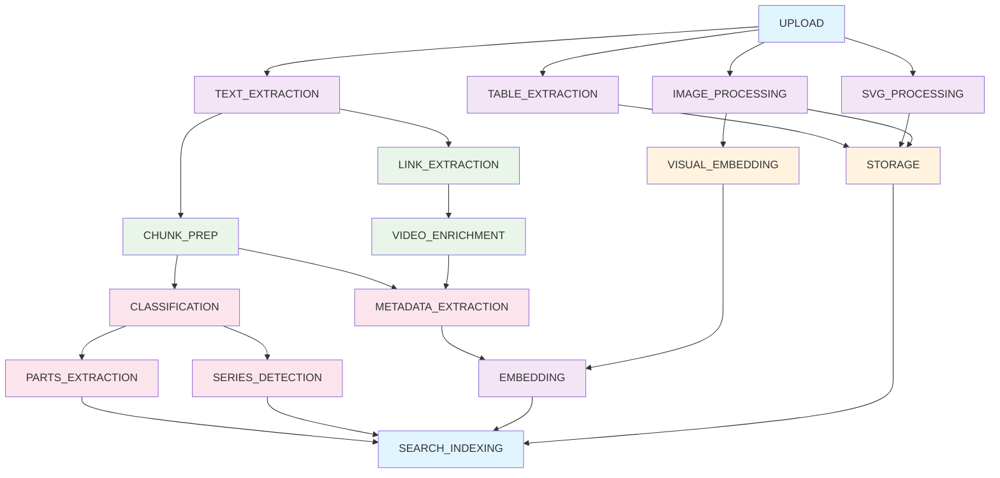
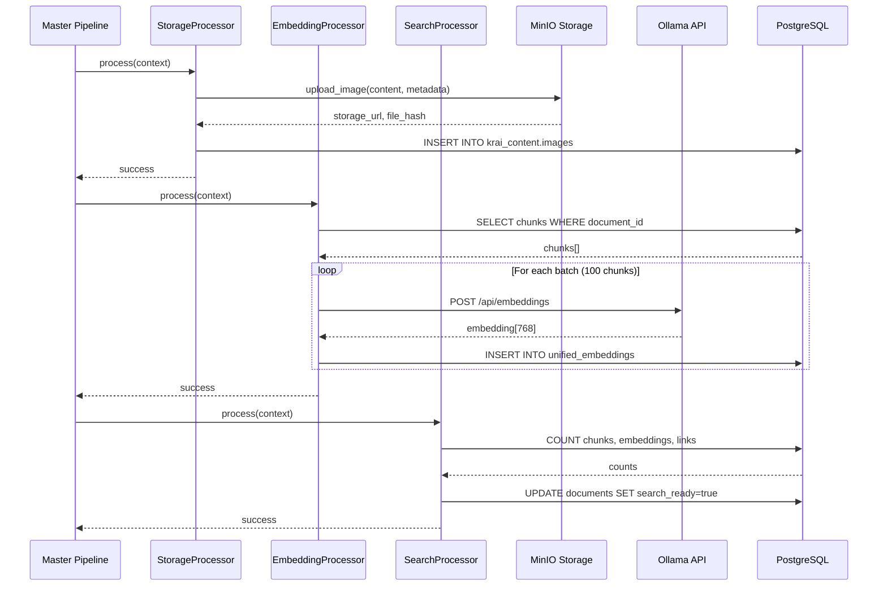

# Pipeline Architecture Documentation

## Overview

The KRAI document processing system uses a **16-stage modular pipeline** that provides granular control, parallel processing capabilities, failure isolation, and comprehensive progress tracking. Each stage performs a specific transformation on the document, allowing for selective processing, debugging, and optimization.

### Key Benefits

- **Granular Control**: Execute individual stages or custom sequences on-demand
- **Failure Isolation**: One stage failure doesn't stop the entire pipeline
- **Progress Tracking**: Real-time status monitoring for each stage
- **Parallel Processing**: Multiple documents can be processed concurrently
- **Resource Optimization**: Skip completed stages with smart processing
- **Debugging Support**: Isolate issues to specific stages

## Architecture Diagram


## Stage Groups

### Initialization (1 stage)
- **UPLOAD**: File upload, validation, hash calculation, initial database record

### Extraction (6 stages)
- **TEXT_EXTRACTION**: Extract text content from PDF pages
- **TABLE_EXTRACTION**: Extract structured tables from documents
- **SVG_PROCESSING**: Convert vector graphics to PNG for Vision AI
- **IMAGE_PROCESSING**: Extract images from PDF, analyze with Vision AI
- **LINK_EXTRACTION**: Extract hyperlinks and references
- **VIDEO_ENRICHMENT**: Optional Brightcove API enrichment for extracted videos

### Processing (5 stages)
- **CHUNK_PREP**: Split text into semantic chunks for search
- **CLASSIFICATION**: Detect document type, manufacturer, series, models
- **METADATA_EXTRACTION**: Extract error codes, specifications, metadata
- **PARTS_EXTRACTION**: Extract spare parts, part numbers, compatibility
- **SERIES_DETECTION**: Detect product series and relationships

### Enrichment (2 stages)
- **VISUAL_EMBEDDING**: Generate embeddings for extracted images
- **EMBEDDING**: Generate text embeddings for semantic search

### Finalization (3 stages)
- **STORAGE**: Upload processed images to MinIO (S3-compatible object storage)
- **EMBEDDING**: Generate 768-dimensional vector embeddings via Ollama (nomic-embed-text)
- **SEARCH_INDEXING**: Update search readiness flags and log analytics

## Stage Dependencies



### Dependency Rules

- **UPLOAD** is the entry point - no dependencies
- **TEXT_EXTRACTION** required for: LINK_EXTRACTION, CHUNK_PREP
- **LINK_EXTRACTION** required for: VIDEO_ENRICHMENT
- **IMAGE_PROCESSING** required for: VISUAL_EMBEDDING
- **CHUNK_PREP** required for: CLASSIFICATION, METADATA_EXTRACTION
- **CLASSIFICATION** required for: PARTS_EXTRACTION, SERIES_DETECTION
- **EMBEDDING** requires: METADATA_EXTRACTION, VISUAL_EMBEDDING
- **SEARCH_INDEXING** is final - requires all other stages

### Final Stage Flow (Storage → Embedding → Search)



### Unified Embeddings Schema (pgvector)

Embeddings are stored in `krai_intelligence.unified_embeddings`:

| Column | Type | Description |
|--------|------|-------------|
| id | uuid | Primary key |
| source_id | uuid | Chunk/image/table ID |
| source_type | varchar(20) | 'text', 'image', 'table', 'context', 'caption' |
| embedding | vector(768) | pgvector 768-dimensional embedding |
| model_name | varchar(100) | e.g. nomic-embed-text |
| embedding_context | text | Truncated context for display |
| metadata | jsonb | document_id, page_number, etc. |
| created_at | timestamp | Creation time |

Similarity search uses cosine distance: `embedding <=> '[0.1,...]'::vector`

### MinIO Integration

- **Bucket:** `document_images` (configurable via OBJECT_STORAGE_BUCKET_IMAGES)
- **Presigned URLs:** Generated in `_generate_storage_path()`
- **Deduplication:** File hash checked via `check_duplicate()` before upload

## Stage Execution Modes

### Full Pipeline
Execute all 16 stages sequentially (default for document uploads):
```bash
python scripts/pipeline_processor.py --file /path/to/document.pdf
```

### Smart Processing
Skip completed stages and only process missing ones:
```bash
python scripts/pipeline_processor.py --document-id <uuid> --smart
```

### Single Stage
Execute one specific stage on-demand:
```bash
python scripts/pipeline_processor.py --document-id <uuid> --stage text_extraction
```

### Multiple Stages
Execute custom stage sequences:
```bash
python scripts/pipeline_processor.py --document-id <uuid> --stages 1,2,5
```

### Batch Processing
Process multiple documents concurrently:
```bash
python scripts/pipeline_processor.py --batch --directory /path/to/documents/
```

## Stage Status Tracking

### Database Schema
Stage status is tracked in the `stage_status` JSONB column in `krai_core.documents`:

```sql
SELECT id, filename, stage_status 
FROM krai_core.documents 
WHERE id = 'your-document-uuid';
```

### Status Values
- `pending`: Stage not started
- `in_progress`: Stage currently running
- `completed`: Stage finished successfully
- `failed`: Stage failed with error

### RPC Functions
PostgreSQL functions for stage status management:

```sql
-- Start a stage
SELECT krai_core.start_stage(document_id, 'text_extraction');

-- Complete a stage
SELECT krai_core.complete_stage(document_id, 'text_extraction');

-- Fail a stage
SELECT krai_core.fail_stage(document_id, 'text_extraction', 'Error message');

-- Get stage status
SELECT krai_core.get_stage_status(document_id, 'text_extraction');
```

### Status Query Examples

```sql
-- Check all completed stages for a document
SELECT jsonb_object_keys(stage_status) as stage_name
FROM krai_core.documents
WHERE id = 'uuid'
AND stage_status->>'status' = 'completed';

-- Find documents with failed stages
SELECT id, filename, stage_status
FROM krai_core.documents
WHERE stage_status ? 'failed'
AND stage_status->>'status' = 'failed';

-- Get processing progress
SELECT 
    id,
    filename,
    (SELECT COUNT(*) FROM jsonb_object_keys(stage_status)) as total_stages,
    (SELECT COUNT(*) FROM jsonb_each(stage_status) WHERE value->>'status' = 'completed') as completed_stages
FROM krai_core.documents
WHERE id = 'uuid';
```

## Implementation Details

### Core Components

#### `backend/core/base_processor.py`
Defines the `Stage` enum and `BaseProcessor` interface:
```python
class Stage(str, Enum):
    UPLOAD = "upload"
    TEXT_EXTRACTION = "text_extraction"
    TABLE_EXTRACTION = "table_extraction"
    # ... all 16 stages

class BaseProcessor:
    async def process(self, document_id: str, **kwargs) -> ProcessResult:
        # Base implementation for all processors
```

#### `backend/pipeline/master_pipeline.py`
Orchestrates stage execution:
```python
class KRMasterPipeline:
    async def run_full_pipeline(self, document_id: str) -> ProcessResult:
        # Execute all 16 stages
    
    async def run_single_stage(self, document_id: str, stage_name: str) -> ProcessResult:
        # Execute specific stage
    
    async def run_stages(self, document_id: str, stages: List[str]) -> ProcessResult:
        # Execute multiple stages
    
    async def smart_process_document(self, document_id: str) -> ProcessResult:
        # Skip completed stages
```

#### `backend/processors/`
Individual stage processors (15 files):
- `upload_processor.py` - UPLOAD stage
- `text_processor.py` - TEXT_EXTRACTION stage
- `table_processor.py` - TABLE_EXTRACTION stage
- `svg_processor.py` - SVG_PROCESSING stage
- `image_processor.py` - IMAGE_PROCESSING stage
- `visual_embedding_processor.py` - VISUAL_EMBEDDING stage
- `link_processor.py` - LINK_EXTRACTION stage
- `video_enrichment_processor.py` - VIDEO_ENRICHMENT stage (optional)
- `chunk_preprocessor.py` - CHUNK_PREP stage
- `classification_processor.py` - CLASSIFICATION stage
- `metadata_processor.py` - METADATA_EXTRACTION stage
- `parts_processor.py` - PARTS_EXTRACTION stage
- `series_processor.py` - SERIES_DETECTION stage
- `storage_processor.py` - STORAGE stage
- `embedding_processor.py` - EMBEDDING stage
- `search_processor.py` - SEARCH_INDEXING stage

#### `scripts/pipeline_processor.py`
CLI interface for pipeline control:
```bash
# Available commands
python scripts/pipeline_processor.py --list-stages
python scripts/pipeline_processor.py --document-id <uuid> --status
python scripts/pipeline_processor.py --help
```

#### `backend/api/document_api.py`
Stage-based API endpoints:
```python
@router.post("/documents/{document_id}/process/stage/{stage_name}")
async def process_single_stage(document_id: str, stage_name: str):
    # Execute single stage

@router.post("/documents/{document_id}/process/stages")
async def process_multiple_stages(document_id: str, stages: List[str]):
    # Execute multiple stages

@router.get("/documents/{document_id}/stages/status")
async def get_stage_status(document_id: str):
    # Get all stage statuses
```

## Performance Characteristics

### Typical Processing Times

| Stage | Typical Time | Dependencies | Resource Requirements |
|-------|--------------|--------------|----------------------|
| UPLOAD | 1-2 seconds | None | Low (CPU, Disk I/O) |
| TEXT_EXTRACTION | 2-5 seconds | UPLOAD | Medium (CPU, Memory) |
| TABLE_EXTRACTION | 3-8 seconds | UPLOAD | Medium (CPU, Memory) |
| SVG_PROCESSING | 2-6 seconds | UPLOAD | Medium (CPU, Memory) |
| IMAGE_PROCESSING | 5-15 seconds | UPLOAD | High (CPU, GPU) |
| VISUAL_EMBEDDING | 3-10 seconds | IMAGE_PROCESSING | High (GPU) |
| LINK_EXTRACTION | 1-3 seconds | TEXT_EXTRACTION | Low (CPU) |
| VIDEO_ENRICHMENT | 1-6 seconds | LINK_EXTRACTION | Low (CPU, Network I/O) |
| CHUNK_PREP | 2-5 seconds | TEXT_EXTRACTION | Medium (CPU, Memory) |
| CLASSIFICATION | 3-8 seconds | TEXT_EXTRACTION | Medium (CPU, Memory) |
| METADATA_EXTRACTION | 4-10 seconds | TEXT_EXTRACTION, CHUNK_PREP | Medium (CPU, Memory) |
| PARTS_EXTRACTION | 3-8 seconds | CLASSIFICATION | Medium (CPU, Memory) |
| SERIES_DETECTION | 2-5 seconds | CLASSIFICATION | Low (CPU, Memory) |
| STORAGE | 2-8 seconds | IMAGE_PROCESSING | Medium (Network, Disk I/O) |
| EMBEDDING | 3-8 seconds | CHUNK_PREP | High (GPU) |
| SEARCH_INDEXING | 1-3 seconds | EMBEDDING | Medium (CPU, Disk I/O) |

### Final Stage Performance Targets (Verification)

| Stage | Target | Notes |
|-------|--------|-------|
| STORAGE | < 5 seconds for 100 images | MinIO upload with deduplication |
| EMBEDDING | < 30 seconds for 100 chunks | Adaptive batching (default 100/batch) |
| SEARCH_INDEXING | < 2 seconds | Metadata updates only |

### Concurrency Limits

- **Max Concurrent Documents**: 5 (configurable)
- **Max Concurrent Stages per Document**: 3 (for independent stages)
- **GPU Queue**: 2 concurrent embedding/vision tasks
- **Database Connections**: 20 (connection pool)

### Optimization Tips

1. **Batch Processing**: Process multiple documents together for better resource utilization
2. **Selective Stages**: Skip unnecessary stages (e.g., text-only processing)
3. **Smart Processing**: Use `--smart` flag to skip completed stages
4. **Resource Scaling**: Adjust concurrency limits based on available hardware
5. **GPU Acceleration**: Ensure NVIDIA Container Toolkit for embedding stages

## Error Handling

### Stage-Level Error Isolation

Each stage runs independently with its own error handling:
```python
try:
    result = await processor.process(document_id, **kwargs)
    await update_stage_status(document_id, stage_name, 'completed')
except Exception as e:
    await update_stage_status(document_id, stage_name, 'failed', str(e))
    logger.error(f"Stage {stage_name} failed: {e}")
```

### Retry Mechanisms

- **Automatic Retry**: 3 attempts with exponential backoff (1s, 2s, 4s)
- **Manual Retry**: Via CLI or API for specific stages
- **Retry Policies**: Configurable per stage type

### Error Logging

```python
# Error context includes:
- Document ID and filename
- Stage name and processor
- Error message and stack trace
- Input parameters and configuration
- Timestamp and retry count
```

### Recovery Strategies

1. **Single Stage Retry**: Re-execute failed stage only
2. **Dependency Chain**: Re-execute failed stage and all dependent stages
3. **Full Reprocess**: Start over from UPLOAD (rare cases)
4. **Manual Intervention**: Fix underlying issue (e.g., missing dependencies)

## Integration Points

### CLI Integration

```bash
# Stage control
python scripts/pipeline_processor.py --document-id <uuid> --stage <stage_name>
python scripts/pipeline_processor.py --document-id <uuid> --stages <stage_list>

# Status monitoring
python scripts/pipeline_processor.py --document-id <uuid> --status
python scripts/pipeline_processor.py --list-stages

# Batch operations
python scripts/pipeline_processor.py --batch --directory /path/to/pdfs/
```

### API Integration

```bash
# Single stage
POST /documents/{id}/process/stage/{stage_name}

# Multiple stages
POST /documents/{id}/process/stages
{
  "stages": ["text_extraction", "image_processing"],
  "stop_on_error": true
}

# Status monitoring
GET /documents/{id}/stages/status
GET /documents/{id}/stages
```

### Dashboard Integration

- **Laravel Filament UI**: Visual stage management
- **Stage Actions**: Individual and bulk stage processing
- **Status Display**: Color-coded badges for each stage
- **Progress Tracking**: Real-time updates via WebSocket
- **Error Reporting**: Detailed error messages and logs

### Background Processing

```python
# FastAPI BackgroundTasks for async processing
@router.post("/documents/{document_id}/process/stage/{stage_name}")
async def process_single_stage(
    document_id: str, 
    stage_name: str,
    background_tasks: BackgroundTasks
):
    background_tasks.add_task(run_stage_async, document_id, stage_name)
    return {"message": "Stage started", "stage": stage_name}
```

## Migration from Legacy

### Old Architecture (Deprecated)

- **File**: `backend/document_processor.py` (2700+ lines)
- **Approach**: Monolithic processing function
- **Status**: Single status field (processing/complete/failed)
- **Error Handling**: Global error handling, difficult to debug
- **Flexibility**: All-or-nothing processing

### New Architecture (Current)

- **Files**: 16 specialized processors in `backend/processors/`
- **Approach**: Modular stage-based processing
- **Status**: Detailed `stage_status` JSONB tracking
- **Error Handling**: Stage-level isolation and recovery
- **Flexibility**: Granular control and selective processing

### Migration Benefits

1. **Maintainability**: Smaller, focused code files
2. **Debugging**: Isolate issues to specific stages
3. **Performance**: Parallel processing of independent stages
4. **Flexibility**: Custom stage sequences and selective processing
5. **Monitoring**: Detailed progress tracking and status reporting

### Legacy Reference

For historical reference and comparison:
- `archive/docs/outdated/DOCUMENT_PROCESSOR_V1.md`
- `backend/document_processor.py` (deprecated)

## Related Documentation

- **Stage Reference**: `docs/processor/STAGE_REFERENCE.md` - Detailed description of each stage
- **Quick Start**: `docs/processor/QUICK_START.md` - Usage examples and tutorials
- **API Documentation**: `docs/api/STAGE_BASED_PROCESSING.md` - API endpoint reference
- **Dashboard Integration**: `docs/LARAVEL_DASHBOARD_INTEGRATION.md` - Laravel Filament integration
- **Architecture**: `docs/ARCHITECTURE.md` - Overall system architecture
