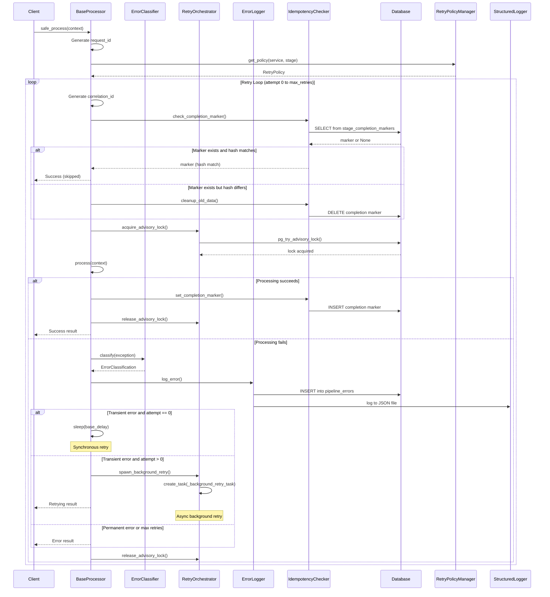

# Retry Engine Integration Guide

## Overview

The KR-AI-Engine implements a sophisticated hybrid retry architecture that combines synchronous and asynchronous retry strategies with intelligent error classification, idempotency checks, and distributed coordination via PostgreSQL advisory locks.

## Architecture

### Hybrid Retry Pattern

The retry system uses a **synchronous-first, asynchronous-subsequent** pattern:

1. **First Attempt**: Execute immediately
2. **First Retry (attempt 0)**: Synchronous retry after `base_delay_seconds`
3. **Subsequent Retries (attempt 1+)**: Spawn background tasks with exponential backoff

This design provides:
- **Fast recovery** for transient errors (immediate sync retry)
- **Non-blocking processing** for persistent issues (async background retries)
- **Resource efficiency** (background tasks don't block the main pipeline)

### Components

#### 1. ErrorClassifier

Classifies exceptions as **transient** (retryable) or **permanent** (non-retryable).

**Transient Errors:**
- HTTP 5xx (500-599)
- HTTP 408 (Request Timeout)
- HTTP 429 (Too Many Requests)
- Connection/Timeout errors
- `httpx.TimeoutException`, `httpx.ConnectError`, `httpx.TransportError`

**Permanent Errors:**
- HTTP 4xx (except 408, 429)
- `ValueError`, `AuthenticationError`, `AuthorizationError`
- Unknown errors (fail-safe approach)

**Usage:**
```python
from backend.core.retry_engine import ErrorClassifier

try:
    result = await some_operation()
except Exception as e:
    classification = ErrorClassifier.classify(e)
    if classification.is_transient:
        # Retry logic
        pass
    else:
        # Fail permanently
        pass
```

#### 2. RetryPolicyManager

Manages retry policies with lazy loading and caching.

**Policy Resolution Order:**
1. In-memory cache (5-minute TTL)
2. Database - stage-specific policy (`service_name` + `stage_name`)
3. Database - service-level policy (`service_name`, `stage_name=NULL`)
4. Code-level default

**Usage:**
```python
from backend.core.retry_engine import RetryPolicyManager

# Get policy for specific service and stage
policy = await RetryPolicyManager.get_policy('firecrawl', 'image_processing')
print(f"Max retries: {policy.max_retries}")
print(f"Base delay: {policy.base_delay_seconds}s")
```

**Default Policies:**
- **firecrawl**: 3 retries, 2s base delay, 60s max delay
- **database**: 5 retries, 1s base delay, 30s max delay
- **ollama**: 3 retries, 2s base delay, 120s max delay
- **minio**: 4 retries, 1.5s base delay, 45s max delay
- **default**: 3 retries, 1s base delay, 60s max delay

#### 3. RetryOrchestrator

Orchestrates retry attempts with exponential backoff and advisory locks.

**Features:**
- Exponential backoff calculation with optional jitter
- PostgreSQL advisory locks for distributed coordination
- Background task spawning for async retries
- Error status tracking in `pipeline_errors` table
- Correlation ID generation for tracking retry chains

**Usage:**
```python
from backend.core.retry_engine import RetryOrchestrator

orchestrator = RetryOrchestrator(db_adapter, error_logger)

# Check if should retry
if await orchestrator.should_retry(classification, attempt, policy):
    # Generate correlation ID
    correlation_id = orchestrator.generate_correlation_id(
        context.request_id, 'image_processing', attempt
    )
    
    # Spawn background retry
    await orchestrator.spawn_background_retry(
        context, attempt, policy, correlation_id, processor.safe_process
    )
```

#### 4. IdempotencyChecker

Prevents duplicate processing using completion markers.

**Features:**
- SHA-256 hash-based data change detection
- Completion marker storage in `krai_system.stage_completion_markers`
- Automatic cleanup of old data when inputs change

**Usage:**
```python
# Check if already processed
marker = await processor._check_completion_marker(context)
if marker:
    current_hash = processor._compute_data_hash(context)
    if marker['data_hash'] == current_hash:
        # Skip processing - data unchanged
        return cached_result
    else:
        # Data changed - cleanup and re-process
        await processor._cleanup_old_data(context)
```

#### 5. ErrorLogger

Logs errors to database and structured JSON files.

**Features:**
- Stores errors in `krai_intelligence.pipeline_errors` table
- Writes structured JSON logs to `logs/errors/YYYY-MM-DD.json`
- Tracks error status: `pending`, `retrying`, `resolved`, `failed`
- Associates errors with correlation IDs for retry tracking

### BaseProcessor Integration

The `BaseProcessor.safe_process()` method implements the full hybrid retry loop:

```python
async def safe_process(self, context: ProcessingContext) -> ProcessingResult:
    """
    Safely execute processing with hybrid retry loop.
    
    Phases:
    A. Initialization - Generate request_id, load retry policy
    B. Hybrid Retry Loop - Iterate through retry attempts
    C. Idempotency Check - Skip if already processed
    D. Advisory Lock Acquisition - Prevent concurrent retries
    E. Processing Execution - Execute actual processing
    F. Exception Handling - Classify and log errors
    G. Retry Decision Logic - Sync vs async retry
    H. Lock Release - Always release advisory lock
    """
```

## Sequence Diagram



## Configuration

### Database Schema

#### Retry Policies Table

```sql
CREATE TABLE krai_system.retry_policies (
    policy_name TEXT PRIMARY KEY,
    service_name TEXT NOT NULL,
    stage_name TEXT,
    max_retries INTEGER NOT NULL DEFAULT 3,
    base_delay_seconds NUMERIC NOT NULL DEFAULT 1.0,
    max_delay_seconds NUMERIC NOT NULL DEFAULT 60.0,
    exponential_base NUMERIC NOT NULL DEFAULT 2.0,
    jitter_enabled BOOLEAN NOT NULL DEFAULT TRUE,
    circuit_breaker_enabled BOOLEAN DEFAULT FALSE,
    circuit_breaker_threshold INTEGER DEFAULT 5,
    circuit_breaker_timeout_seconds INTEGER DEFAULT 60,
    created_at TIMESTAMP DEFAULT NOW(),
    updated_at TIMESTAMP DEFAULT NOW()
);
```

#### Stage Completion Markers Table

```sql
CREATE TABLE krai_system.stage_completion_markers (
    document_id UUID NOT NULL,
    stage_name TEXT NOT NULL,
    completed_at TIMESTAMP NOT NULL DEFAULT NOW(),
    data_hash TEXT NOT NULL,
    metadata JSONB,
    PRIMARY KEY (document_id, stage_name)
);
```

#### Pipeline Errors Table

```sql
CREATE TABLE krai_intelligence.pipeline_errors (
    error_id UUID PRIMARY KEY DEFAULT gen_random_uuid(),
    document_id UUID,
    stage_name TEXT,
    error_type TEXT NOT NULL,
    error_category TEXT NOT NULL,
    error_message TEXT,
    stack_trace TEXT,
    retry_attempt INTEGER DEFAULT 0,
    max_retries INTEGER,
    status TEXT DEFAULT 'pending',
    correlation_id TEXT,
    next_retry_at TIMESTAMP,
    created_at TIMESTAMP DEFAULT NOW(),
    updated_at TIMESTAMP DEFAULT NOW()
);
```

### Custom Retry Policy

To add a custom retry policy:

```sql
INSERT INTO krai_system.retry_policies (
    policy_name,
    service_name,
    stage_name,
    max_retries,
    base_delay_seconds,
    max_delay_seconds,
    exponential_base,
    jitter_enabled
) VALUES (
    'custom_image_processing',
    'firecrawl',
    'image_processing',
    5,
    3.0,
    120.0,
    2.5,
    TRUE
);
```

### Processor Configuration

Configure retry behavior in processor initialization:

```python
class ImageProcessor(BaseProcessor):
    def __init__(self, config: dict = None):
        # Set service_name for retry policy lookup
        config = config or {}
        config['service_name'] = 'firecrawl'
        
        super().__init__("image_processing", config)
        
        # Set db_adapter to enable retry infrastructure
        self.db_adapter = create_database_adapter()
```

## Correlation ID Tracking

Correlation IDs enable tracking of retry chains across attempts.

**Format:**
```
{request_id}.stage_{stage_name}.retry_{attempt}
```

**Example:**
```
req_a3f2e8d1.stage_image_processing.retry_2
```

**Components:**
- `request_id`: Unique request identifier (generated per document)
- `stage_name`: Processing stage name
- `attempt`: Retry attempt number (0-indexed)

**Querying Retry Chains:**
```sql
SELECT * FROM krai_intelligence.pipeline_errors
WHERE correlation_id LIKE 'req_a3f2e8d1%'
ORDER BY created_at;
```

## Troubleshooting

### Common Issues

#### 1. Retries Not Executing

**Symptoms:** Processing fails without retry attempts

**Causes:**
- `db_adapter` not set on processor
- Error classified as permanent
- Max retries set to 0

**Solution:**
```python
# Ensure db_adapter is set
processor.db_adapter = create_database_adapter()

# Check error classification
classification = ErrorClassifier.classify(exception)
print(f"Is transient: {classification.is_transient}")

# Check retry policy
policy = await RetryPolicyManager.get_policy('service', 'stage')
print(f"Max retries: {policy.max_retries}")
```

#### 2. Advisory Lock Contention

**Symptoms:** "Retry already in progress" messages

**Causes:**
- Multiple processes attempting concurrent retries
- Lock not released due to crash

**Solution:**
```sql
-- Check active advisory locks
SELECT * FROM pg_locks WHERE locktype = 'advisory';

-- Manually release stuck lock (use lock_id from logs)
SELECT pg_advisory_unlock(1234567890);
```

#### 3. Idempotency False Positives

**Symptoms:** Processing skipped when it shouldn't be

**Causes:**
- Data hash collision (extremely rare)
- Completion marker not cleaned up after data change

**Solution:**
```sql
-- Check completion markers
SELECT * FROM krai_system.stage_completion_markers
WHERE document_id = 'doc_id';

-- Manually remove marker to force re-processing
DELETE FROM krai_system.stage_completion_markers
WHERE document_id = 'doc_id' AND stage_name = 'stage_name';
```

#### 4. Background Tasks Not Completing

**Symptoms:** Errors stuck in "retrying" status

**Causes:**
- Background task exception not caught
- Database connection lost
- Process terminated during retry

**Solution:**
```sql
-- Find stuck retrying errors
SELECT * FROM krai_intelligence.pipeline_errors
WHERE status = 'retrying' 
  AND created_at < NOW() - INTERVAL '1 hour';

-- Manually mark as failed
UPDATE krai_intelligence.pipeline_errors
SET status = 'failed', updated_at = NOW()
WHERE error_id = 'error_id';
```

### Monitoring

#### Query Retry Statistics

```sql
-- Retry success rate by stage
SELECT 
    stage_name,
    COUNT(*) as total_errors,
    SUM(CASE WHEN status = 'resolved' THEN 1 ELSE 0 END) as resolved,
    ROUND(100.0 * SUM(CASE WHEN status = 'resolved' THEN 1 ELSE 0 END) / COUNT(*), 2) as success_rate
FROM krai_intelligence.pipeline_errors
WHERE created_at > NOW() - INTERVAL '24 hours'
GROUP BY stage_name
ORDER BY total_errors DESC;
```

#### Query Average Retry Attempts

```sql
SELECT 
    stage_name,
    AVG(retry_attempt) as avg_attempts,
    MAX(retry_attempt) as max_attempts
FROM krai_intelligence.pipeline_errors
WHERE status = 'resolved'
  AND created_at > NOW() - INTERVAL '24 hours'
GROUP BY stage_name;
```

#### Query Error Categories

```sql
SELECT 
    error_category,
    error_type,
    COUNT(*) as count
FROM krai_intelligence.pipeline_errors
WHERE created_at > NOW() - INTERVAL '24 hours'
GROUP BY error_category, error_type
ORDER BY count DESC;
```

## Best Practices

### 1. Set Appropriate Max Retries

- **Fast operations** (< 1s): 3-5 retries
- **Medium operations** (1-10s): 3 retries
- **Slow operations** (> 10s): 2-3 retries
- **External APIs**: 3-4 retries with longer delays

### 2. Configure Exponential Backoff

- **Base delay**: Start with 1-2 seconds
- **Exponential base**: Use 2.0 for standard doubling
- **Max delay**: Cap at 60-120 seconds
- **Jitter**: Always enable to prevent thundering herd

### 3. Enable Idempotency

Always set `db_adapter` on processors to enable idempotency checks:

```python
processor.db_adapter = create_database_adapter()
```

### 4. Monitor Error Logs

Regularly review structured error logs:

```bash
tail -f logs/errors/$(date +%Y-%m-%d).json | jq .
```

### 5. Clean Up Old Data

Periodically clean up old completion markers and error logs:

```sql
-- Delete markers older than 30 days
DELETE FROM krai_system.stage_completion_markers
WHERE completed_at < NOW() - INTERVAL '30 days';

-- Archive old errors
INSERT INTO krai_intelligence.pipeline_errors_archive
SELECT * FROM krai_intelligence.pipeline_errors
WHERE created_at < NOW() - INTERVAL '90 days';

DELETE FROM krai_intelligence.pipeline_errors
WHERE created_at < NOW() - INTERVAL '90 days';
```

## Examples

### Example 1: Custom Processor with Retry Support

```python
from backend.core.base_processor import BaseProcessor
from backend.core.types import ProcessingContext, ProcessingResult
from backend.services.database_factory import create_database_adapter

class CustomProcessor(BaseProcessor):
    def __init__(self):
        super().__init__(
            "custom_processor",
            config={"service_name": "custom_service"}
        )
        # Enable retry infrastructure
        self.db_adapter = create_database_adapter()
    
    async def process(self, context: ProcessingContext) -> ProcessingResult:
        # Your processing logic here
        # Transient errors will be automatically retried
        result = await some_external_api_call()
        
        return self.create_success_result(
            data={"result": result},
            metadata={"document_id": context.document_id}
        )

# Usage
processor = CustomProcessor()
result = await processor.safe_process(context)
```

### Example 2: Manual Retry Control

```python
from backend.core.retry_engine import ErrorClassifier, RetryPolicyManager, RetryOrchestrator
from backend.services.error_logging_service import ErrorLogger

async def process_with_custom_retry(context):
    # Get retry policy
    policy = await RetryPolicyManager.get_policy('custom', 'stage')
    
    # Initialize components
    error_logger = ErrorLogger(db_adapter)
    orchestrator = RetryOrchestrator(db_adapter, error_logger)
    
    for attempt in range(policy.max_retries + 1):
        try:
            result = await risky_operation()
            return result
        except Exception as e:
            classification = ErrorClassifier.classify(e)
            
            if not classification.is_transient or attempt >= policy.max_retries:
                raise
            
            # Calculate backoff
            delay = orchestrator.calculate_backoff_delay(attempt, policy)
            await asyncio.sleep(delay)
```

### Example 3: Querying Retry History

```python
async def get_retry_history(document_id: str):
    query = """
        SELECT 
            error_id,
            stage_name,
            error_type,
            retry_attempt,
            status,
            correlation_id,
            created_at
        FROM krai_intelligence.pipeline_errors
        WHERE document_id = $1
        ORDER BY created_at DESC
    """
    
    errors = await db_adapter.fetch_all(query, (document_id,))
    return errors
```

## Performance Considerations

### Memory Usage

- **Cache size**: 100 policies with 5-minute TTL (~10KB)
- **Background tasks**: Each spawned task uses ~50KB
- **Advisory locks**: Minimal overhead (PostgreSQL native)

### Database Load

- **Policy queries**: Cached, minimal load
- **Advisory locks**: Non-blocking, low overhead
- **Error logging**: Async, batched writes
- **Completion markers**: Single row per stage per document

### Optimization Tips

1. **Use service-level policies** for common configurations
2. **Enable jitter** to prevent thundering herd
3. **Monitor background task count** to prevent resource exhaustion
4. **Archive old errors** to keep table size manageable
5. **Use connection pooling** for database adapter

## Testing

Run integration tests:

```bash
pytest backend/tests/test_base_processor_integration.py -v
pytest backend/tests/test_retry_engine.py -v
```

Run specific test:

```bash
pytest backend/tests/test_base_processor_integration.py::test_sync_retry_success -v
```

## References

- **BaseProcessor**: `backend/core/base_processor.py`
- **Retry Engine**: `backend/core/retry_engine.py`
- **Error Logger**: `backend/services/error_logging_service.py`
- **Idempotency**: `backend/core/idempotency.py`
- **Integration Tests**: `backend/tests/test_base_processor_integration.py`
- **Unit Tests**: `backend/tests/test_retry_engine.py`
